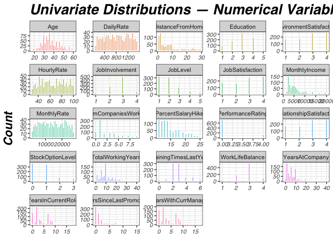
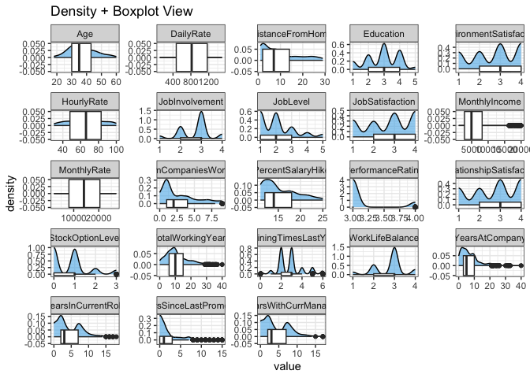
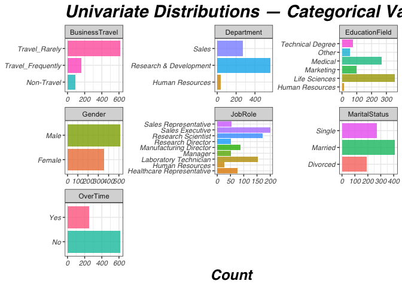
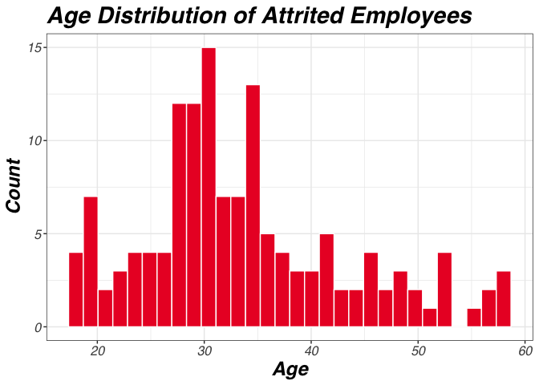
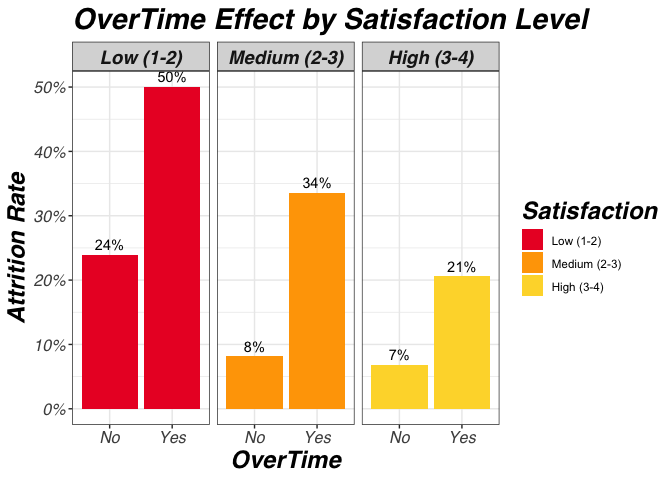
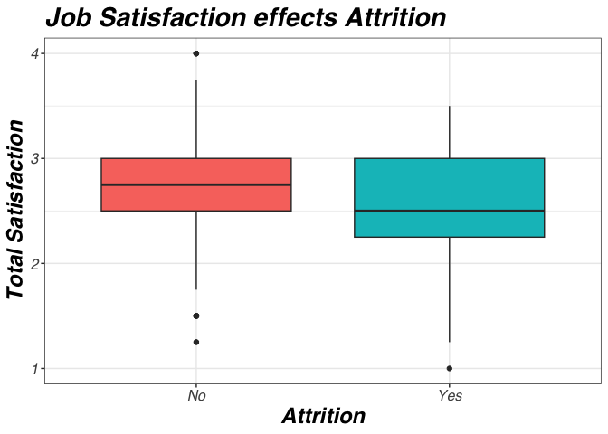
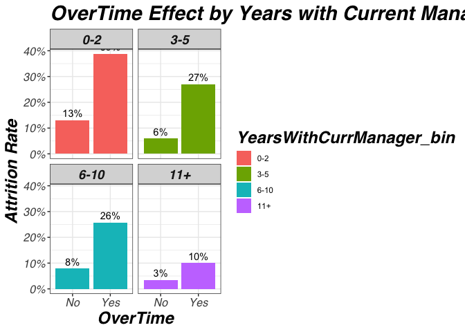
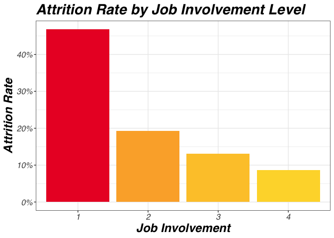
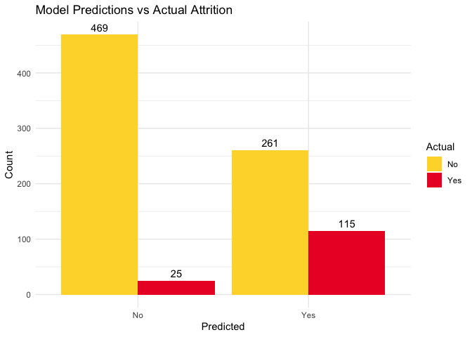
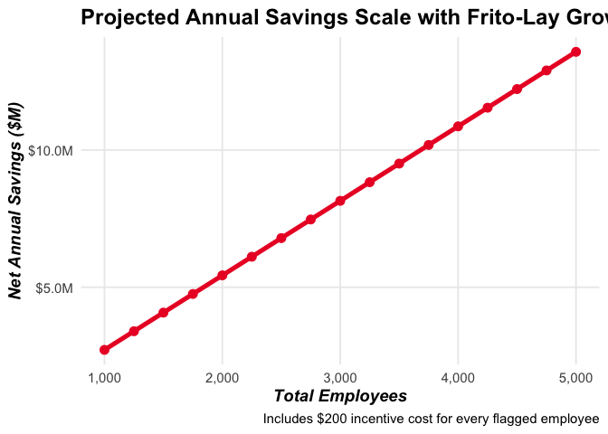

<script src="attrition_files/libs/kePrint-0.0.1/kePrint.js"></script>
<link href="attrition_files/libs/lightable-0.0.1/lightable.css" rel="stylesheet" />

- [<span class="toc-section-number">1</span> 1. Import](#1-import)
- [<span class="toc-section-number">2</span> 2. Tidy](#2-tidy)
  - [<span class="toc-section-number">2.1</span> 2.1 Constants and
    Sequential](#21-constants-and-sequential)
  - [<span class="toc-section-number">2.2</span> 2.2 Feature
    Selection](#22-feature-selection)
- [<span class="toc-section-number">3</span> 3. Exploratory Data
  Analysis (EDA)](#3-exploratory-data-analysis-eda)
  - [<span class="toc-section-number">3.1</span> 3.1 Quick
    summaries](#31-quick-summaries)
    - [<span class="toc-section-number">3.1.1</span> 3.1.1 Correlation
      Matrix for numeric
      variables](#311-correlation-matrix-for-numeric-variables)
    - [<span class="toc-section-number">3.1.2</span> 3.1.2 Chi-Squared
      tests for categorical
      variables](#312-chi-squared-tests-for-categorical-variables)
  - [<span class="toc-section-number">3.2</span> 3.2 Distributions and
    Visuals](#32-distributions-and-visuals)
  - [<span class="toc-section-number">3.3</span> 3.3 Multivariate
    relationships](#33-multivariate-relationships)
  - [<span class="toc-section-number">3.4</span> 3.4 Missing values &
    outliers](#34-missing-values--outliers)
  - [<span class="toc-section-number">3.5</span> 3.5 Initial insights &
    hypotheses](#35-initial-insights--hypotheses)
    - [<span class="toc-section-number">3.5.1</span> 3.5.1 Is JobLevel
      or JobRole correlated to
      Attrition?](#351-is-joblevel-or-jobrole-correlated-to-attrition)
    - [<span class="toc-section-number">3.5.2</span> 3.5.2 Which Pay
      Variable should be relied
      on?](#352-which-pay-variable-should-be-relied-on)
    - [<span class="toc-section-number">3.5.3</span> 3.5.3 What is the
      significance of each variable in
      optimized_data?](#353-what-is-the-significance-of-each-variable-in-optimized_data)
    - [<span class="toc-section-number">3.5.4</span> Running list of
      unanswer QOIs](#running-list-of-unanswer-qois)
- [<span class="toc-section-number">4</span> 4. Transform & Feature
  Engineering](#4-transform--feature-engineering)
  - [<span class="toc-section-number">4.1</span> 4.1 Base KNN
    transformation](#41-base-knn-transformation)
  - [<span class="toc-section-number">4.2</span> 4.2 Base NB
    transformation](#42-base-nb-transformation)
  - [<span class="toc-section-number">4.3</span> 4.3 Optimized NB
    transformation](#43-optimized-nb-transformation)
- [<span class="toc-section-number">5</span> 5. Modeling](#5-modeling)
  - [<span class="toc-section-number">5.1</span> 5.1 Preliminary base
    models](#51-preliminary-base-models)
    - [<span class="toc-section-number">5.1.1</span> 5.1.1
      KNN](#511-knn)
    - [<span class="toc-section-number">5.1.2</span> 5.1.2 NB](#512-nb)
  - [<span class="toc-section-number">5.2</span> 5.2 Tuning](#52-tuning)
    - [<span class="toc-section-number">5.2.1</span> 5.2.1
      KNN](#521-knn)
    - [<span class="toc-section-number">5.2.2</span> 5.2.2 NB](#522-nb)
  - [<span class="toc-section-number">5.3</span> 5.3
    Optimizing](#53-optimizing)
    - [<span class="toc-section-number">5.3.1</span> 5.3.1
      KNN](#531-knn)
    - [<span class="toc-section-number">5.3.2</span> 5.3.2 NB](#532-nb)
- [<span class="toc-section-number">6</span> 6. Model Evaluation against
  Competition dataset](#6-model-evaluation-against-competition-dataset)
  - [<span class="toc-section-number">6.1</span> 6.1 KNN](#61-knn)
  - [<span class="toc-section-number">6.2</span> 6.2 NB](#62-nb)
- [<span class="toc-section-number">7</span> 7. Communicate (Final
  Results & Insights)](#7-communicate-final-results--insights)
  - [<span class="toc-section-number">7.1</span> 7.1 Who’s leaving the
    company?](#71-whos-leaving-the-company)
  - [<span class="toc-section-number">7.2</span> 7.2 Why are they
    leaving?](#72-why-are-they-leaving)
  - [<span class="toc-section-number">7.3</span> 7.3 What can you do
    about it?](#73-what-can-you-do-about-it)

executive summary

# 1. Import

``` r
data <- read.csv('CaseStudy1-data.csv')
dim(data)
summary(data)
```

# 2. Tidy

``` r
sum(is.na(data))
```

    [1] 0

``` r
sum(is.null(data))
```

    [1] 0

``` r
for (col in names(data)) {
  if (is.character(data[[col]])) {
    cat("Unique values in", col, ":\n")
    print(unique(data[[col]]))
    cat("\n")
  }
}
```

    Unique values in Attrition :
    [1] "No"  "Yes"

    Unique values in BusinessTravel :
    [1] "Travel_Rarely"     "Travel_Frequently" "Non-Travel"       

    Unique values in Department :
    [1] "Sales"                  "Research & Development" "Human Resources"       

    Unique values in EducationField :
    [1] "Life Sciences"    "Medical"          "Marketing"        "Technical Degree"
    [5] "Other"            "Human Resources" 

    Unique values in Gender :
    [1] "Male"   "Female"

    Unique values in JobRole :
    [1] "Sales Executive"           "Research Director"        
    [3] "Manufacturing Director"    "Research Scientist"       
    [5] "Sales Representative"      "Healthcare Representative"
    [7] "Manager"                   "Human Resources"          
    [9] "Laboratory Technician"    

    Unique values in MaritalStatus :
    [1] "Divorced" "Single"   "Married" 

    Unique values in Over18 :
    [1] "Y"

    Unique values in OverTime :
    [1] "No"  "Yes"

Since Attrition is our target variable check for imbalance.

``` r
str(data)
```

    'data.frame':   870 obs. of  36 variables:
     $ ID                      : int  1 2 3 4 5 6 7 8 9 10 ...
     $ Age                     : int  32 40 35 32 24 27 41 37 34 34 ...
     $ Attrition               : chr  "No" "No" "No" "No" ...
     $ BusinessTravel          : chr  "Travel_Rarely" "Travel_Rarely" "Travel_Frequently" "Travel_Rarely" ...
     $ DailyRate               : int  117 1308 200 801 567 294 1283 309 1333 653 ...
     $ Department              : chr  "Sales" "Research & Development" "Research & Development" "Sales" ...
     $ DistanceFromHome        : int  13 14 18 1 2 10 5 10 10 10 ...
     $ Education               : int  4 3 2 4 1 2 5 4 4 4 ...
     $ EducationField          : chr  "Life Sciences" "Medical" "Life Sciences" "Marketing" ...
     $ EmployeeCount           : int  1 1 1 1 1 1 1 1 1 1 ...
     $ EmployeeNumber          : int  859 1128 1412 2016 1646 733 1448 1105 1055 1597 ...
     $ EnvironmentSatisfaction : int  2 3 3 3 1 4 2 4 3 4 ...
     $ Gender                  : chr  "Male" "Male" "Male" "Female" ...
     $ HourlyRate              : int  73 44 60 48 32 32 90 88 87 92 ...
     $ JobInvolvement          : int  3 2 3 3 3 3 4 2 3 2 ...
     $ JobLevel                : int  2 5 3 3 1 3 1 2 1 2 ...
     $ JobRole                 : chr  "Sales Executive" "Research Director" "Manufacturing Director" "Sales Executive" ...
     $ JobSatisfaction         : int  4 3 4 4 4 1 3 4 3 3 ...
     $ MaritalStatus           : chr  "Divorced" "Single" "Single" "Married" ...
     $ MonthlyIncome           : int  4403 19626 9362 10422 3760 8793 2127 6694 2220 5063 ...
     $ MonthlyRate             : int  9250 17544 19944 24032 17218 4809 5561 24223 18410 15332 ...
     $ NumCompaniesWorked      : int  2 1 2 1 1 1 2 2 1 1 ...
     $ Over18                  : chr  "Y" "Y" "Y" "Y" ...
     $ OverTime                : chr  "No" "No" "No" "No" ...
     $ PercentSalaryHike       : int  11 14 11 19 13 21 12 14 19 14 ...
     $ PerformanceRating       : int  3 3 3 3 3 4 3 3 3 3 ...
     $ RelationshipSatisfaction: int  3 1 3 3 3 3 1 3 4 2 ...
     $ StandardHours           : int  80 80 80 80 80 80 80 80 80 80 ...
     $ StockOptionLevel        : int  1 0 0 2 0 2 0 3 1 1 ...
     $ TotalWorkingYears       : int  8 21 10 14 6 9 7 8 1 8 ...
     $ TrainingTimesLastYear   : int  3 2 2 3 2 4 5 5 2 3 ...
     $ WorkLifeBalance         : int  2 4 3 3 3 2 2 3 3 2 ...
     $ YearsAtCompany          : int  5 20 2 14 6 9 4 1 1 8 ...
     $ YearsInCurrentRole      : int  2 7 2 10 3 7 2 0 1 2 ...
     $ YearsSinceLastPromotion : int  0 4 2 5 1 1 0 0 0 7 ...
     $ YearsWithCurrManager    : int  3 9 2 7 3 7 3 0 0 7 ...

``` r
table(data$Attrition) # Low positive rate, could be difficult to get good specificity
```


     No Yes 
    730 140 

``` r
# Recognizing attrition should be factor to ensure positive is Yes for modeling
data <- data %>% mutate(Attrition = factor(Attrition, levels = c('No','Yes')))
```

``` r
# Summary of Attrition variable
attrition_summary <- data %>%
  count(Attrition) %>%
  mutate(Percentage = round(n / sum(n) * 100, 1))

print(attrition_summary)
```

      Attrition   n Percentage
    1        No 730       83.9
    2       Yes 140       16.1

Strong imbalance will make sensitivity difficult to maximize.

## 2.1 Constants and Sequential

Dropping these variables as they provide no predictive power.

``` r
data = select(data, -c(
  'EmployeeCount', # All 1s
  'Over18', # All Yes,
  'EmployeeNumber', # sequential
  'ID',
  'StandardHours' # All 80
  ))
```

## 2.2 Feature Selection

Updated recurring throughout EDA and modeling.

``` r
optimized_data = data %>%
  mutate(
    TotalSatisfaction = (
      EnvironmentSatisfaction + 
      JobSatisfaction + 
      RelationshipSatisfaction + 
      WorkLifeBalance) / 4) %>%
  select(-c(
  'DailyRate', 'HourlyRate', 'MonthlyRate', # See 3.5.2
  'BusinessTravel', 'Education', 'EducationField', 'Gender', # See 3.1.2
  'YearsAtCompany', 'YearsInCurrentRole', 'YearsSinceLastPromotion', # See 3.1.1
  'PercentSalaryHike', 'PerformanceRating', # See 3.1.1
  'TotalWorkingYears', 'TrainingTimesLastYear', # Tenure metric chosen YearsWithCurrManager
  'EnvironmentSatisfaction', 'JobSatisfaction', 'RelationshipSatisfaction', 'WorkLifeBalance' # Derive TotalSatisfaction
  ))
```

# 3. Exploratory Data Analysis (EDA)

## 3.1 Quick summaries

### 3.1.1 Correlation Matrix for numeric variables

Run prior to section 4.2 transformations for understanding paired data.

``` r
numeric_data <- optimized_data %>% select(where(is.numeric))
cor_matrix <- cor(numeric_data, use = "pairwise.complete.obs")
print(round(cor_matrix, 2))
```

                           Age DistanceFromHome JobInvolvement JobLevel
    Age                   1.00             0.01           0.02     0.48
    DistanceFromHome      0.01             1.00           0.00     0.02
    JobInvolvement        0.02             0.00           1.00    -0.02
    JobLevel              0.48             0.02          -0.02     1.00
    MonthlyIncome         0.48            -0.01           0.00     0.95
    NumCompaniesWorked    0.29            -0.05          -0.01     0.14
    StockOptionLevel      0.04             0.07           0.07     0.02
    YearsWithCurrManager  0.19            -0.02           0.01     0.37
    TotalSatisfaction    -0.02            -0.02          -0.02    -0.02
                         MonthlyIncome NumCompaniesWorked StockOptionLevel
    Age                           0.48               0.29             0.04
    DistanceFromHome             -0.01              -0.05             0.07
    JobInvolvement                0.00              -0.01             0.07
    JobLevel                      0.95               0.14             0.02
    MonthlyIncome                 1.00               0.16             0.02
    NumCompaniesWorked            0.16               1.00             0.03
    StockOptionLevel              0.02               0.03             1.00
    YearsWithCurrManager          0.33              -0.12             0.04
    TotalSatisfaction            -0.03               0.00             0.01
                         YearsWithCurrManager TotalSatisfaction
    Age                                  0.19             -0.02
    DistanceFromHome                    -0.02             -0.02
    JobInvolvement                       0.01             -0.02
    JobLevel                             0.37             -0.02
    MonthlyIncome                        0.33             -0.03
    NumCompaniesWorked                  -0.12              0.00
    StockOptionLevel                     0.04              0.01
    YearsWithCurrManager                 1.00             -0.01
    TotalSatisfaction                   -0.01              1.00

``` r
cor_melt <- melt(cor_matrix)
cor_melt <- cor_melt[cor_melt$Var1 != cor_melt$Var2, ]  # Remove self-correlations

# Sort by absolute correlation (descending)
cor_melt <- cor_melt[order(-abs(cor_melt$value)), ]
print(cor_melt)
```

                       Var1                 Var2         value
    32        MonthlyIncome             JobLevel  0.9516400488
    40             JobLevel        MonthlyIncome  0.9516400488
    5         MonthlyIncome                  Age  0.4842883010
    37                  Age        MonthlyIncome  0.4842883010
    4              JobLevel                  Age  0.4794235642
    28                  Age             JobLevel  0.4794235642
    35 YearsWithCurrManager             JobLevel  0.3665674724
    67             JobLevel YearsWithCurrManager  0.3665674724
    44 YearsWithCurrManager        MonthlyIncome  0.3284874527
    68        MonthlyIncome YearsWithCurrManager  0.3284874527
    6    NumCompaniesWorked                  Age  0.2935218773
    46                  Age   NumCompaniesWorked  0.2935218773
    8  YearsWithCurrManager                  Age  0.1853837950
    64                  Age YearsWithCurrManager  0.1853837950
    42   NumCompaniesWorked        MonthlyIncome  0.1558943184
    50        MonthlyIncome   NumCompaniesWorked  0.1558943184
    33   NumCompaniesWorked             JobLevel  0.1408348284
    49             JobLevel   NumCompaniesWorked  0.1408348284
    53 YearsWithCurrManager   NumCompaniesWorked -0.1229746810
    69   NumCompaniesWorked YearsWithCurrManager -0.1229746810
    25     StockOptionLevel       JobInvolvement  0.0723029729
    57       JobInvolvement     StockOptionLevel  0.0723029729
    16     StockOptionLevel     DistanceFromHome  0.0716804281
    56     DistanceFromHome     StockOptionLevel  0.0716804281
    15   NumCompaniesWorked     DistanceFromHome -0.0489092444
    47     DistanceFromHome   NumCompaniesWorked -0.0489092444
    7      StockOptionLevel                  Age  0.0447595755
    55                  Age     StockOptionLevel  0.0447595755
    62 YearsWithCurrManager     StockOptionLevel  0.0365425741
    70     StockOptionLevel YearsWithCurrManager  0.0365425741
    52     StockOptionLevel   NumCompaniesWorked  0.0328872107
    60   NumCompaniesWorked     StockOptionLevel  0.0328872107
    45    TotalSatisfaction        MonthlyIncome -0.0328046097
    77        MonthlyIncome    TotalSatisfaction -0.0328046097
    9     TotalSatisfaction                  Age -0.0232696737
    73                  Age    TotalSatisfaction -0.0232696737
    13             JobLevel     DistanceFromHome  0.0217270544
    29     DistanceFromHome             JobLevel  0.0217270544
    36    TotalSatisfaction             JobLevel -0.0193385745
    76             JobLevel    TotalSatisfaction -0.0193385745
    43     StockOptionLevel        MonthlyIncome  0.0188887219
    59        MonthlyIncome     StockOptionLevel  0.0188887219
    34     StockOptionLevel             JobLevel  0.0188872312
    58             JobLevel     StockOptionLevel  0.0188872312
    17 YearsWithCurrManager     DistanceFromHome -0.0177006119
    65     DistanceFromHome YearsWithCurrManager -0.0177006119
    18    TotalSatisfaction     DistanceFromHome -0.0176005016
    74     DistanceFromHome    TotalSatisfaction -0.0176005016
    27    TotalSatisfaction       JobInvolvement -0.0170514286
    75       JobInvolvement    TotalSatisfaction -0.0170514286
    3        JobInvolvement                  Age  0.0160732956
    19                  Age       JobInvolvement  0.0160732956
    22             JobLevel       JobInvolvement -0.0158750522
    30       JobInvolvement             JobLevel -0.0158750522
    26 YearsWithCurrManager       JobInvolvement  0.0108872824
    66       JobInvolvement YearsWithCurrManager  0.0108872824
    72    TotalSatisfaction YearsWithCurrManager -0.0107808642
    80 YearsWithCurrManager    TotalSatisfaction -0.0107808642
    63    TotalSatisfaction     StockOptionLevel  0.0104586236
    79     StockOptionLevel    TotalSatisfaction  0.0104586236
    14        MonthlyIncome     DistanceFromHome -0.0066671546
    38     DistanceFromHome        MonthlyIncome -0.0066671546
    2      DistanceFromHome                  Age  0.0066471121
    10                  Age     DistanceFromHome  0.0066471121
    24   NumCompaniesWorked       JobInvolvement -0.0056138446
    48       JobInvolvement   NumCompaniesWorked -0.0056138446
    12       JobInvolvement     DistanceFromHome -0.0042775053
    20     DistanceFromHome       JobInvolvement -0.0042775053
    54    TotalSatisfaction   NumCompaniesWorked -0.0042247898
    78   NumCompaniesWorked    TotalSatisfaction -0.0042247898
    23        MonthlyIncome       JobInvolvement  0.0004473792
    39       JobInvolvement        MonthlyIncome  0.0004473792

``` r
# Visualize correlations (requires corrplot package)
library(corrplot)
corrplot(
  cor_matrix,
  method = "circle", 
  type = "upper", 
  tl.cex = 0.8, 
  order = 'hclust',
  hclust.method = 'ward'
)
```

-1.png)

``` r
# Full correlation matrix as heatmap
cor_melt <- melt(cor_matrix)
cor_melt <- cor_melt[cor_melt$Var1 != cor_melt$Var2, ]  # Remove self-correlations

ggplot(cor_melt, aes(x = Var1, y = Var2, fill = value)) +
  geom_tile(color = "white") +
  scale_fill_gradient2(low = "blue", mid = "white", high = "red", midpoint = 0, limits = c(-1, 1)) +
  labs(title = "Correlation Matrix",
       x = "", y = "",
       fill = "Correlation") +
  theme_bw() +
  theme(
    axis.text.x = element_text(angle = 45, hjust = 1, size = 8),
    axis.text.y = element_text(size = 8),
    title = element_text(size = 14, face = "bold"),
    plot.margin = margin(1, 1, 1, 1, "cm")
  )
```

-2.png)

``` r
# Get top correlated pairs without duplicates
pairs <- cor_melt %>%
  filter(as.character(Var1) < as.character(Var2)) %>%  # Remove duplicates
  arrange(desc(abs(value))) # Sort by absolute correlation

write.csv(pairs, "pairs.csv", row.names = FALSE)
```

Keeping two paired variables as single inputs to a model may bias it.

### 3.1.2 Chi-Squared tests for categorical variables

Correlation finds relationship between numerical values, use chi-squared
test for categorical value association. Hypothesis: H0 = No association
between predictor and Attrition; H1 = Association exists. Using cramer’s
V measurement for feature selection

``` r
cat_vars <- names(data)[sapply(data, is.character) | sapply(data, is.factor)]
cat_vars <- setdiff(cat_vars, "Attrition")  # Exclude target

# Initialize results data frame
table_results <- data.frame(Variable = character(), CramersV = numeric())

for (var in cat_vars) {
  cat("\n=== Contingency Table for", var, "vs. Attrition ===\n")
  table_result <- table(data[[var]], data$Attrition)
  print(table_result)
  
  # Chi-square test (use simulate.p.value for small expected counts to avoid warnings)
  chi_test <- chisq.test(table_result, simulate.p.value = TRUE)
  print(chi_test)
  
  # Cramér's V for strength of association (0-1 scale)
  v_value <- cramersV(table_result)
  cat("Cramér's V:", round(v_value, 3), "\n")

  # Append to results data frame
  table_results <- rbind(table_results, data.frame(Variable = var, CramersV = v_value))
}
```


    === Contingency Table for BusinessTravel vs. Attrition ===
                       
                         No Yes
      Non-Travel         83  11
      Travel_Frequently 123  35
      Travel_Rarely     524  94

        Pearson's Chi-squared test with simulated p-value (based on 2000
        replicates)

    data:  table_result
    X-squared = 5.9945, df = NA, p-value = 0.05197

    Cramér's V: 0.083 

    === Contingency Table for Department vs. Attrition ===
                            
                              No Yes
      Human Resources         29   6
      Research & Development 487  75
      Sales                  214  59

        Pearson's Chi-squared test with simulated p-value (based on 2000
        replicates)

    data:  table_result
    X-squared = 9.329, df = NA, p-value = 0.009495

    Cramér's V: 0.104 

    === Contingency Table for EducationField vs. Attrition ===
                      
                        No Yes
      Human Resources   11   4
      Life Sciences    305  53
      Marketing         80  20
      Medical          233  37
      Other             43   9
      Technical Degree  58  17

        Pearson's Chi-squared test with simulated p-value (based on 2000
        replicates)

    data:  table_result
    X-squared = 6.4114, df = NA, p-value = 0.2729

    Cramér's V: 0.086 

    === Contingency Table for Gender vs. Attrition ===
            
              No Yes
      Female 301  53
      Male   429  87

        Pearson's Chi-squared test with simulated p-value (based on 2000
        replicates)

    data:  table_result
    X-squared = 0.55469, df = NA, p-value = 0.5157

    Cramér's V: 0.022 

    === Contingency Table for JobRole vs. Attrition ===
                               
                                 No Yes
      Healthcare Representative  68   8
      Human Resources            21   6
      Laboratory Technician     123  30
      Manager                    47   4
      Manufacturing Director     85   2
      Research Director          50   1
      Research Scientist        140  32
      Sales Executive           167  33
      Sales Representative       29  24

        Pearson's Chi-squared test with simulated p-value (based on 2000
        replicates)

    data:  table_result
    X-squared = 60.543, df = NA, p-value = 0.0004998

    Cramér's V: 0.264 

    === Contingency Table for MaritalStatus vs. Attrition ===
              
                No Yes
      Divorced 179  12
      Married  352  58
      Single   199  70

        Pearson's Chi-squared test with simulated p-value (based on 2000
        replicates)

    data:  table_result
    X-squared = 34.406, df = NA, p-value = 0.0004998

    Cramér's V: 0.199 

    === Contingency Table for OverTime vs. Attrition ===
         
           No Yes
      No  558  60
      Yes 172  80

        Pearson's Chi-squared test with simulated p-value (based on 2000
        replicates)

    data:  table_result
    X-squared = 64.383, df = NA, p-value = 0.0004998

    Cramér's V: 0.269 

``` r
# Bar chart for Cramér's V
ggplot(table_results, aes(x = reorder(Variable, CramersV), y = CramersV)) +
  geom_bar(stat = "identity", fill = "#EB192C") +
  coord_flip() +
  labs(title = "Cramér's V vs Attrition",
       x = "Variable",
       y = "Cramér's V") +
  theme_bw() +
  theme(
    legend.position = 'none',
    title = element_text(family = 'sans', face = 'bold.italic', size = 18),
    axis.text = element_text(family = 'sans', face = 'italic')
  )
```

-1.png)

Require more formal test: MaritalStatus vs Attrition p-value: .004998
OverTime vs Attrition p-value: .0004998

Further exploration in 3.5.1: Department vs Attrition p-value: .01049
JobRole vs Attrition p-value: .0004998

Not very strong results to justify further investigation: BusinessTravel
vs Attrition p-value: .04898 Cramer’s V: .083 EducationField vs
Attrition p-value: .2769 Cramer’s V: .086 Gender vs Attrition p-value:
.5117 Cramer’s V: .022

## 3.2 Distributions and Visuals

``` r
data %>%
  select(where(is.numeric)) %>%
  pivot_longer(everything()) %>%
  ggplot(aes(x = value, fill = name)) +
  geom_histogram(bins = 30, alpha = 0.7, color = "white") +
  facet_wrap(~ name, scales = "free") +
  labs(title = "Univariate Distributions — Numerical Variables",
       x = NULL, y = "Count") +
  theme_bw() +
  theme(
    legend.position = 'none',
    title = element_text(family = 'sans', face = 'bold.italic', size = 18),
    axis.text = element_text(family = 'sans', face = 'italic')
  )
```



``` r
# Alternative: density + boxplot combo
data %>%
  select(where(is.numeric)) %>%
  pivot_longer(everything()) %>%
  ggplot(aes(x = value)) +
  geom_density(fill = "#56B4E9", alpha = 0.6) +
  geom_boxplot(width = 0.1, fill = "white") +
  facet_wrap(~ name, scales = "free") +
  labs(title = "Density + Boxplot View") +
  theme_bw()
```



``` r
# Categorical Variables
data %>% select(-Attrition) %>%
  select(where(is.factor) | where(is.character)) %>%
  pivot_longer(everything()) %>%
  ggplot(aes(x = value, fill = value)) +
  geom_bar(alpha = 0.8) +
  facet_wrap(~ name, scales = "free") +
  coord_flip() +
  labs(title = "Univariate Distributions — Categorical Variables",
       x = NULL, y = "Count") +
  theme_bw() +
  theme(
    legend.position = 'none',
    title = element_text(family = 'sans', face = 'bold.italic', size = 18),
    axis.text = element_text(family = 'sans', face = 'italic')
  )
```



``` r
# Attrition by age
data %>%
  filter(Attrition == "Yes") %>%
  ggplot(aes(x = Age)) +
  geom_histogram(fill = "#EB192C", bins = 30, color = 'white') +
  labs(title = "Age Distribution of Attrited Employees",
       x = "Age",
       y = "Count") +
  theme_bw() +
  theme(
    title = element_text(family = 'sans', face = 'bold.italic', size = 18),
    axis.text = element_text(family = 'sans', face = 'italic', size = 12)
  )
```



``` r
# Filter to attrited employees
attrited_data <- data %>% filter(Attrition == "Yes")

# Define multipliers based on JobLevel
multipliers <- c("1" = 0.3, "2" = 0.5, "3" = 1.25, "4" = 1.5, "5" = 4.0)

# Calculate annualized cost for each employee
attrited_data <- attrited_data %>%
  mutate(
    AnnualizedIncome = MonthlyIncome * 12,
    Multiplier = multipliers[as.character(JobLevel)],
    CostOfLoss = AnnualizedIncome * Multiplier
  )

# Summarize total cost by JobLevel
cost_by_level <- attrited_data %>%
  group_by(JobLevel) %>%
  summarize(
    TotalCost = sum(CostOfLoss, na.rm = TRUE),
    .groups = "drop"
  )

# Bar chart for costs by job level
ggplot(cost_by_level, aes(x = factor(JobLevel), y = TotalCost / 1e6)) +
  geom_bar(stat = "identity", fill = "#EB192C", color = 'white') +
  geom_text(aes(label = paste0("$", round(TotalCost / 1e6, 1), "M")), 
            vjust = -0.5, size = 5) +
  labs(title = "Replacement Costs",
       x = "Job Level",
       y = "") +
  theme_bw() +
  theme(
    title = element_text(family = 'sans', face = 'bold.italic', size = 18),
    axis.text = element_text(family = 'sans', face = 'italic', size = 12),
    axis.text.y = element_blank()
  )
```


## 3.3 Multivariate relationships

``` r
# Compute correlations of numeric variables with Attrition (as binary)
numeric_vars <- data %>% select(where(is.numeric))
numeric_vars$Attrition_Num <- as.numeric(data$Attrition == "Yes")

# Correlation matrix
cor_matrix <- cor(numeric_vars, use = "pairwise.complete.obs")

# Extract correlations with Attrition_Num
cor_with_attrition <- cor_matrix["Attrition_Num", -ncol(cor_matrix)]  # Exclude self-correlation

# Sort by absolute value descending
cor_with_attrition <- sort(abs(cor_with_attrition), decreasing = TRUE)

print(cor_with_attrition)
```

              JobInvolvement        TotalWorkingYears                 JobLevel 
                 0.187793409              0.167206122              0.162136444 
          YearsInCurrentRole            MonthlyIncome                      Age 
                 0.156215707              0.154914955              0.149383577 
            StockOptionLevel     YearsWithCurrManager           YearsAtCompany 
                 0.148680303              0.146782245              0.128754060 
             JobSatisfaction          WorkLifeBalance         DistanceFromHome 
                 0.107520935              0.089789709              0.087136293 
     EnvironmentSatisfaction    TrainingTimesLastYear       NumCompaniesWorked 
                 0.077325405              0.062726088              0.061018887 
                   Education              MonthlyRate RelationshipSatisfaction 
                 0.049442357              0.043232173              0.039646611 
                  HourlyRate                DailyRate        PerformanceRating 
                 0.036554178              0.033793125              0.015333837 
           PercentSalaryHike  YearsSinceLastPromotion 
                 0.015328069              0.004573321 

``` r
# Create a data frame for visualization
cor_df <- data.frame(Variable = names(cor_with_attrition), Correlation = cor_with_attrition)

# Bar chart of absolute correlations
ggplot(cor_df, aes(x = reorder(Variable, Correlation), y = Correlation)) +
  geom_bar(stat = "identity", fill = "#EB192C") +
  coord_flip() +
  labs(title = "Correlate with Attrition (Numeric)",
       x = "Variable",
       y = "Correlation") +
  theme_bw() +
  theme_bw() +
  theme(
    title = element_text(family = 'sans', face = 'bold.italic', size = 18),
    axis.text = element_text(family = 'sans', face = 'bold.italic', size = 16)
  )
```


``` r
ggplot(data, aes(x = Age, y = MonthlyIncome, color = Attrition)) +
  geom_point(alpha = 0.6) +
  facet_wrap(~ Department) +
  labs(title = "Age vs Monthly Income by Department and Attrition") +
  theme_bw()
```


``` r
satisfaction_summary <- data %>%
  group_by(JobSatisfaction, EnvironmentSatisfaction, Attrition) %>%
  summarise(Count = n(), .groups = "drop")

ggplot(satisfaction_summary, aes(x = factor(JobSatisfaction), y = factor(EnvironmentSatisfaction), fill = Count)) +
  geom_tile() +
  facet_wrap(~ Attrition) +
  labs(title = "Job vs Environment Satisfaction by Attrition") +
  theme_minimal()
```


## 3.4 Missing values & outliers

## 3.5 Initial insights & hypotheses

### 3.5.1 Is JobLevel or JobRole correlated to Attrition?

``` r
data %>%
  group_by(JobRole, JobLevel) %>%
  summarise(
    n = n(),
    attrition_rate = mean(Attrition == "Yes") * 100,
    .groups = "drop"
  ) %>%
  arrange(desc(attrition_rate)) %>%
  print(n = 26) # Visual Idea, JobRole attrition rates facet_grid by JobLevel.
```

    # A tibble: 26 × 4
       JobRole                   JobLevel     n attrition_rate
       <chr>                        <int> <int>          <dbl>
     1 Sales Representative             1    50          48   
     2 Laboratory Technician            3     3          33.3 
     3 Human Resources                  1    23          26.1 
     4 Sales Executive                  4     8          25   
     5 Laboratory Technician            1   115          22.6 
     6 Research Scientist               1   141          21.3 
     7 Manager                          3     5          20   
     8 Sales Executive                  3    51          19.6 
     9 Healthcare Representative        3    23          17.4 
    10 Healthcare Representative        4     6          16.7 
    11 Sales Executive                  2   141          14.9 
    12 Manager                          5    22          13.6 
    13 Laboratory Technician            2    35           8.57
    14 Research Director                5    15           6.67
    15 Research Scientist               2    30           6.67
    16 Healthcare Representative        2    47           6.38
    17 Manufacturing Director           3    26           3.85
    18 Manufacturing Director           2    54           1.85
    19 Human Resources                  2     2           0   
    20 Human Resources                  3     2           0   
    21 Manager                          4    24           0   
    22 Manufacturing Director           4     7           0   
    23 Research Director                3    21           0   
    24 Research Director                4    15           0   
    25 Research Scientist               3     1           0   
    26 Sales Representative             2     3           0   

Good Compliment predictor, for example 48% attrition rate for Sales
representative

``` r
cor(data$JobLevel, as.numeric(data$Attrition == "Yes"))
```

    [1] -0.1621364

JobLevel has a -.16 correlation. Higher level means lower attrition.

``` r
data %>%
  group_by(Department) %>%
  summarise(
    n = n(),
    attrition_yes = sum(Attrition == "Yes"),
    attrition_rate = mean(Attrition == "Yes") * 100
  ) %>%
  arrange(desc(attrition_rate))
```

    # A tibble: 3 × 4
      Department                 n attrition_yes attrition_rate
      <chr>                  <int>         <int>          <dbl>
    1 Sales                    273            59           21.6
    2 Human Resources           35             6           17.1
    3 Research & Development   562            75           13.3

Both JobRole and JobLevel can be strong predictors of attrition.

### 3.5.2 Which Pay Variable should be relied on?

There are several pay variables: DailyRate, HourlyRate, MonthlyRate,
MonthlyIncome.

First, we should be able to see a mathmatical correlation between Daily,
Hourly and Monthly rate.

``` r
summary(data[, c("DailyRate", "HourlyRate", "MonthlyRate")])
```

       DailyRate        HourlyRate      MonthlyRate   
     Min.   : 103.0   Min.   : 30.00   Min.   : 2094  
     1st Qu.: 472.5   1st Qu.: 48.00   1st Qu.: 8092  
     Median : 817.5   Median : 66.00   Median :14074  
     Mean   : 815.2   Mean   : 65.61   Mean   :14326  
     3rd Qu.:1165.8   3rd Qu.: 83.00   3rd Qu.:20456  
     Max.   :1499.0   Max.   :100.00   Max.   :26997  

``` r
ratios <- data.frame(
  Ratio_Type = c("Monthly / (Hourly * 160)", "Monthly / (Daily * 20)", "Daily / (Hourly * 8)"),
  Average_Ratio = c(
    mean(data$MonthlyRate / (data$HourlyRate * 160)),
    mean(data$MonthlyRate / (data$DailyRate * 20)),
    mean(data$DailyRate / (data$HourlyRate * 8))  # assuming 8 hours per day
  )
)
print(ratios)
```

                    Ratio_Type Average_Ratio
    1 Monthly / (Hourly * 160)      1.524708
    2   Monthly / (Daily * 20)      1.334845
    3     Daily / (Hourly * 8)      1.718536

The resulting ratios do not equal 1, likely from synthetic data
generation. Next, determine relevance as a variable by visualizing a
relationship between attrition and each variable.

``` r
# Facet wrap histograms for pay rates
data %>%
  filter(Attrition == "Yes") %>%
  select(HourlyRate, DailyRate, MonthlyRate, MonthlyIncome) %>%
  pivot_longer(everything(), names_to = "Variable", values_to = "Value") %>%
  ggplot(aes(x = Value)) +
  geom_histogram(fill = "#EB192C", bins = 30) +
  facet_wrap(~ Variable, scales = "free") +
  labs(title = "Attrition by Pay Rates",
       x = "Value", y = "Count") +
  theme_bw() +
  theme(
    title = element_text(family = 'sans', face = 'bold.italic', size = 18),
    axis.text = element_text(family = 'sans', face = 'bold.italic', size = 16)
  )
```


MonthlyIncome shows a right skewed distribution and all others are
non-normal or provide no indicators. Checking for correlation to chose
best features for models.

``` r
# Correlation matrix for pay rates
cor_matrix <- data %>% 
  select(contains("Rate"), MonthlyIncome) %>% 
  cor(use = "pairwise.complete.obs")

# Melt for heatmap
cor_melt <- melt(cor_matrix)

# Heatmap visual
ggplot(cor_melt, aes(x = Var1, y = Var2, fill = value)) +
  geom_tile(color = "white") +
  geom_text(aes(label = round(value, 2)), color = "black", size = 4) +
  scale_fill_gradient2(low = "#EB192C", mid = "white", high = "#FDD836", midpoint = 0, limits = c(-1, 1)) +
  labs(title = "Correlation Matrix of Pay Rates",
       x = "", y = "",
       fill = "Correlation") +
  theme_bw() +
  theme(
    title = element_text(family = 'sans', face = 'bold.italic', size = 18),
    axis.text = element_text(family = 'sans', face = 'bold.italic', size = 16),
    axis.text.x = element_text(angle = 15, hjust = 1)
  )
```


These variables have nearly no relevant correlation. MonthlyIncome
provides a strong dataset for predicting attrition. Consider dropping
HourlyRate, DailyRate, MonthlyRate, and keeping MonthlyIncome in feature
selection.

### 3.5.3 What is the significance of each variable in optimized_data?

Visualize and represent mathmatically which variables are most impacting
attrition among our optimized_data set to verify our current retained
and engineered variables.

``` r
# Baseline comparison and check on assumed important variables
logit_full <- glm(
  Attrition ~ ., 
  data = data %>% 
    mutate(Attrition = factor(Attrition, levels = c("No", "Yes"))), 
  family = binomial(link = "logit")
)

# Clean summary (only significant variables)
library(broom)
tidy(logit_full, exponentiate = TRUE, conf.int = TRUE) %>%
  filter(p.value < 0.05) %>%
  select(term, estimate, conf.low, conf.high, p.value) %>%
  mutate(odds_ratio = round(estimate, 2),
         p_value = round(p.value, 4)) %>%
  arrange(desc(odds_ratio))
```

    # A tibble: 16 × 7
       term                  estimate conf.low conf.high  p.value odds_ratio p_value
       <chr>                    <dbl>    <dbl>     <dbl>    <dbl>      <dbl>   <dbl>
     1 OverTimeYes              7.45     4.53     12.6   9.72e-15       7.45  0     
     2 MaritalStatusSingle      5.90     2.21     17.0   6.05e- 4       5.9   0.0006
     3 BusinessTravelTravel…    4.86     1.81     14.1   2.43e- 3       4.86  0.0024
     4 MaritalStatusMarried     2.55     1.15      6.08  2.68e- 2       2.55  0.0268
     5 NumCompaniesWorked       1.28     1.15      1.43  7.20e- 6       1.28  0     
     6 YearsSinceLastPromot…    1.28     1.14      1.45  4.74e- 5       1.28  0     
     7 DistanceFromHome         1.05     1.02      1.08  7.42e- 4       1.05  0.0007
     8 TotalWorkingYears        0.900    0.827     0.976 1.23e- 2       0.9   0.0123
     9 YearsInCurrentRole       0.877    0.776     0.989 3.32e- 2       0.88  0.0332
    10 YearsWithCurrManager     0.854    0.752     0.971 1.49e- 2       0.85  0.0149
    11 RelationshipSatisfac…    0.772    0.621     0.956 1.80e- 2       0.77  0.018 
    12 TrainingTimesLastYear    0.749    0.608     0.917 5.86e- 3       0.75  0.0059
    13 EnvironmentSatisfact…    0.702    0.557     0.881 2.44e- 3       0.7   0.0024
    14 JobSatisfaction          0.612    0.488     0.761 1.41e- 5       0.61  0     
    15 WorkLifeBalance          0.566    0.404     0.789 8.52e- 4       0.57  0.0009
    16 JobInvolvement           0.453    0.321     0.632 4.53e- 6       0.45  0     

YearsInCurrentRole p-value = .283 but is left out of our model since it
correlates highly with YearsWithCurrManager. Same with
YearsSinceLastPromotion which did not correlated well with Attrition.

Potential for derived statistic in YearsInCurrentRole,
YearsWithCurrManager and TotalWorkingYears.

``` r
# effect while controlling for everything except categorical variables (JobROle, Departmnet) that create seperation for this model. 
logit_model <- glm(
  Attrition ~ OverTime + Age + DistanceFromHome + JobInvolvement + JobLevel + MaritalStatus + NumCompaniesWorked + StockOptionLevel + YearsWithCurrManager + TotalSatisfaction + MonthlyIncome,
  data = optimized_data, family = binomial)
summary(logit_model)
```


    Call:
    glm(formula = Attrition ~ OverTime + Age + DistanceFromHome + 
        JobInvolvement + JobLevel + MaritalStatus + NumCompaniesWorked + 
        StockOptionLevel + YearsWithCurrManager + TotalSatisfaction + 
        MonthlyIncome, family = binomial, data = optimized_data)

    Coefficients:
                           Estimate Std. Error z value Pr(>|z|)    
    (Intercept)           3.225e+00  9.326e-01   3.458 0.000544 ***
    OverTimeYes           1.702e+00  2.221e-01   7.662 1.83e-14 ***
    Age                  -3.810e-02  1.481e-02  -2.573 0.010093 *  
    DistanceFromHome      3.713e-02  1.306e-02   2.843 0.004471 ** 
    JobInvolvement       -6.967e-01  1.495e-01  -4.661 3.15e-06 ***
    JobLevel             -2.969e-01  3.439e-01  -0.863 0.387987    
    MaritalStatusMarried  8.632e-01  3.737e-01   2.310 0.020892 *  
    MaritalStatusSingle   1.535e+00  4.517e-01   3.398 0.000679 ***
    NumCompaniesWorked    1.344e-01  4.367e-02   3.077 0.002089 ** 
    StockOptionLevel     -1.577e-01  1.805e-01  -0.874 0.382277    
    YearsWithCurrManager -7.337e-02  3.776e-02  -1.943 0.052012 .  
    TotalSatisfaction    -1.161e+00  2.168e-01  -5.353 8.66e-08 ***
    MonthlyIncome        -2.108e-05  8.419e-05  -0.250 0.802293    
    ---
    Signif. codes:  0 '***' 0.001 '**' 0.01 '*' 0.05 '.' 0.1 ' ' 1

    (Dispersion parameter for binomial family taken to be 1)

        Null deviance: 767.67  on 869  degrees of freedom
    Residual deviance: 565.36  on 857  degrees of freedom
    AIC: 591.36

    Number of Fisher Scoring iterations: 6

``` r
# Create multiples for reporting
tidy(logit_model, exponentiate = TRUE, conf.int = TRUE) %>%
  filter(p.value < 0.05) %>%
  mutate(
    odds_ratio = round(estimate, 2),
    lower_95   = round(conf.low, 2),
    upper_95   = round(conf.high, 2),
    p_value    = round(p.value, 4)
  ) %>%
  select(term, odds_ratio, lower_95, upper_95, p_value) %>%
  arrange(desc(odds_ratio))
```

    # A tibble: 9 × 5
      term                 odds_ratio lower_95 upper_95 p_value
      <chr>                     <dbl>    <dbl>    <dbl>   <dbl>
    1 (Intercept)               25.2      4.11   160.    0.0005
    2 OverTimeYes                5.48     3.57     8.53  0     
    3 MaritalStatusSingle        4.64     1.97    11.7   0.0007
    4 MaritalStatusMarried       2.37     1.17     5.13  0.0209
    5 NumCompaniesWorked         1.14     1.05     1.25  0.0021
    6 DistanceFromHome           1.04     1.01     1.06  0.0045
    7 Age                        0.96     0.93     0.99  0.0101
    8 JobInvolvement             0.5      0.37     0.67  0     
    9 TotalSatisfaction          0.31     0.2      0.48  0     

Ordered by z-score:

There is strong evidence to suggest employees with OverTime are 5.5
times more likely to leave the company (Logistic p-value = .00054).

There is overwhelming evidence to suggest employees with low
TotalSatisfaction are at risk of attrition (p-value \<.0001). Best
estimate is for every 1 point increase in TotalSatisfaction the employee
is 69% less likely to leave the firm.

Considering combining these two variables into high risk variable

There is overwhelming evidence to suggest employees with low
JobInvolvement are at risk of attrition (p-value \< .0001). Best
estimate is for every 1 point increase in JobInvolvement there is a 50%
reduction in attrition risk.

There is strong evidence to suggest single employees are at risk of high
attrition rates compared to all other marital statuses (p-value =
.0006). Best estimate is single workers are 4.6 times more likely to
leave the firm than married or divorced workers.

There is sufficient evidence to suggest employees with high turnover
(NumCompaniesWorked) are more likely to leave the firm (p-value .002).
Best estimate is employees are 1.14 times more likely to leave the firm
for every previous company they worked at.

There is sufficient evidence to suggest DistanceFromHome influences
attrition rates (p-value = .0044). Best estimate is for every mile the
employee travels they are 1.04 times more likely to leave the firm.

All else considered, MonthlyIncome and JobLevel are not as significant
as above variables.

#### 3.5.3.1 Visual tests for significance and derived indicators as features

``` r
data %>%
  group_by(Department, OverTime) %>%
  summarise(attrition_rate = mean(Attrition == "Yes"), .groups = "drop") %>%
  ggplot(aes(x = OverTime, y = attrition_rate, fill = Department)) +
  geom_col(position = "dodge") +
  geom_text(aes(label = paste0(round(attrition_rate*100), "%")), 
            position = position_dodge(width = 0.9), vjust = -0.5) +
  labs(title = "OverTime Effect Is Strongest in Sales",
       y = "Attrition Rate") +
  theme_bw() +
  theme(
    title = element_text(family = 'sans', face = 'bold.italic', size = 18),
    axis.text = element_text(family = 'sans', face = 'italic', size = 12),
  )
```


``` r
# Same plot but by JobRole
data %>%
  group_by(JobRole, OverTime) %>%
  summarise(attrition_rate = mean(Attrition == "Yes"), .groups = "drop") %>%
  ggplot(aes(x = OverTime, y = attrition_rate, fill = JobRole)) +
  geom_col(position = "dodge") +
  geom_text(aes(label = paste0(round(attrition_rate*100), "%")), 
            position = position_dodge(width = 0.9), vjust = -0.5) +
  scale_y_continuous(labels = scales::percent) +
  labs(title = "OverTime Effect Is Strongest in Sales",
       y = "Attrition Rate") +
  theme_bw() +
  theme(
    title = element_text(family = 'sans', face = 'bold.italic', size = 18),
    axis.text = element_text(family = 'sans', face = 'italic', size = 12),
  )
```


OverTime & Sales = High risk for attrition

``` r
# Compute tertile breaks for NumCompaniesWorked
tertile_breaks <- quantile(data$NumCompaniesWorked, probs = c(0, 1/3, 2/3, 1), na.rm = TRUE)

# Create binned variable using tertiles
data1 <- data %>%
  mutate(NumCompaniesWorked_bin = cut(NumCompaniesWorked, 
                                       breaks = tertile_breaks, 
                                       labels = c("Low", "Medium", "High"),
                                       include.lowest = TRUE))

# NumCompaniesWorked effect by MaritalStatus
data1 %>%
  group_by(MaritalStatus, NumCompaniesWorked_bin) %>%
  summarise(attrition_rate = mean(Attrition == "Yes"), .groups = "drop") %>%
  ggplot(aes(x = MaritalStatus, y = attrition_rate, fill = NumCompaniesWorked_bin)) +
  geom_col(position = "dodge") +
  geom_text(aes(label = paste0(round(attrition_rate*100), "%")), 
            position = position_dodge(width = 0.9), vjust = -0.5) +
  scale_y_continuous(labels = scales::percent) +
  labs(title = "NumCompaniesWorked Effect by MaritalStatus",
       y = "Attrition Rate") +
  theme_bw() +
  theme(
    title = element_text(family = 'sans', face = 'bold.italic', size = 18),
    axis.text = element_text(family = 'sans', face = 'italic', size = 12),
  )
```


``` r
# Create binned variable with custom breaks
data1 <- data %>%
  mutate(NumCompaniesWorked_bin = cut(NumCompaniesWorked, 
                                       breaks = c(0, 3, 5, 7, 10), 
                                       labels = c("0-2", "3-4", "5-6", "7-9"),
                                       include.lowest = TRUE))

# NumCompaniesWorked effect by MaritalStatus
data1 %>%
  group_by(MaritalStatus, NumCompaniesWorked_bin) %>%
  summarise(attrition_rate = mean(Attrition == "Yes"), .groups = "drop") %>%
  ggplot(aes(x = MaritalStatus, y = attrition_rate, fill = NumCompaniesWorked_bin)) +
  geom_col(position = "dodge") +
  geom_text(aes(label = paste0(round(attrition_rate*100), "%")), 
            position = position_dodge(width = 0.9), vjust = -0.5) +
  scale_y_continuous(labels = scales::percent) +
  labs(title = "NumCompaniesWorked Effect by MaritalStatus",
       y = "Attrition Rate") +
  theme_bw() +
  theme(
    title = element_text(family = 'sans', face = 'bold.italic', size = 18),
    axis.text = element_text(family = 'sans', face = 'italic', size = 12),
  )
```


No clear indicator that may allow us to combined these variables.

``` r
# Bin TotalSatisfaction into categories for plotting (adjust bins as needed)
data1 <- optimized_data %>%
  mutate(TotalSatisfaction_bin = cut(TotalSatisfaction, 
                                      breaks = c(0, 2, 3, 4), 
                                      labels = c("Low (1-2)", "Medium (2-3)", "High (3-4)")))

# OverTime and TotalSatisfaction effect on attrition
data1 %>%
  group_by(OverTime, TotalSatisfaction_bin) %>%
  summarise(attrition_rate = mean(Attrition == "Yes"), .groups = "drop") %>%
  ggplot(aes(x = OverTime, y = attrition_rate, fill = TotalSatisfaction_bin)) +
  geom_col(position = "dodge") +
  scale_fill_manual(values = c("Low (1-2)" = "#EB192C", "Medium (2-3)" = "#FFA500", "High (3-4)" = "#FDD836")) +
  scale_y_continuous(labels = scales::percent) +
  geom_text(aes(label = paste0(round(attrition_rate*100), "%")), 
            position = position_dodge(width = 0.9), vjust = -0.5) +
  facet_wrap(~ TotalSatisfaction_bin) +
  labs(title = "OverTime Effect by Satisfaction Level",
       y = "Attrition Rate",
       fill = 'Satisfaction') +
  theme_bw() +
  theme(
    title = element_text(family = 'sans', face = 'bold.italic', size = 18),
    axis.text = element_text(family = 'sans', face = 'italic', size = 12),
    strip.text = element_text(family = 'sans', face = 'bold.italic', size = 14)
  )
```



``` r
# Boxplot showing TotalSatisfaction distribution by Attrition status
ggplot(optimized_data, aes(x = Attrition, y = TotalSatisfaction, fill = Attrition)) +
  geom_boxplot() +
  labs(title = "Job Satisfaction effects Attrition",
       y = "Total Satisfaction") +
  theme_bw() +
  theme(
    legend.position = "none",
    title = element_text(family = 'sans', face = 'bold.italic', size = 18),
    axis.text = element_text(family = 'sans', face = 'italic', size = 12)
  )
```



``` r
# Bin YearsWithCurrManager into categories for plotting (adjust bins as needed)
data1 <- data %>%
  mutate(YearsWithCurrManager_bin = cut(YearsWithCurrManager, 
                                         breaks = c(0, 2, 5, 10, Inf), 
                                         labels = c("0-2", "3-5", "6-10", "11+"),
                                         include.lowest = TRUE))

# OverTime and YearsWithCurrManager effect on attrition
data1 %>%
  group_by(OverTime, YearsWithCurrManager_bin) %>%
  summarise(attrition_rate = mean(Attrition == "Yes"), .groups = "drop") %>%
  ggplot(aes(x = OverTime, y = attrition_rate, fill = YearsWithCurrManager_bin)) +
  geom_col(position = "dodge") +
  geom_text(aes(label = paste0(round(attrition_rate*100), "%")), 
            position = position_dodge(width = 0.9), vjust = -0.5) +
  facet_wrap(~ YearsWithCurrManager_bin) +
  scale_y_continuous(labels = scales::percent) +
  labs(title = "OverTime Effect by Years with Current Manager",
       y = "Attrition Rate") +
  theme_bw() +
  theme(
    title = element_text(family = 'sans', face = 'bold.italic', size = 18),
    axis.text = element_text(family = 'sans', face = 'italic', size = 12),
    strip.text = element_text(family = 'sans', face = 'bold.italic', size = 14)
  )
```



``` r
# Job Involvement
data %>%
  group_by(JobInvolvement) %>%
  summarise(AttritionRate = mean(Attrition == "Yes")) %>%
  ggplot(aes(x = factor(JobInvolvement), y = AttritionRate, fill = AttritionRate)) +
  geom_col() +
  scale_fill_gradient(low = "#FDD836", high = "#EB192C") +  # Gradient from yellow to red
  scale_y_continuous(labels = scales::percent) +
  labs(title = "Attrition Rate by Job Involvement Level", y = "Attrition Rate", x = "Job Involvement") +
  theme_bw() +
  theme(
    title = element_text(family = 'sans', face = 'bold.italic', size = 18),
    axis.text = element_text(family = 'sans', face = 'italic', size = 12),
    strip.text = element_text(family = 'sans', face = 'bold.italic', size = 14),
    legend.position = "none"  # Hide legend since fill is mapped to value
  )
```



``` r
data %>%
  group_by(MaritalStatus) %>%
  summarise(attrition_rate = mean(Attrition == "Yes")) %>%
  mutate(MaritalStatus = fct_relevel(MaritalStatus, "Single", "Married", "Divorced")) %>%
  ggplot(aes(x = MaritalStatus, y = attrition_rate, fill = attrition_rate)) +
  geom_col(color = "white", linewidth = 0.8) +
  geom_text(aes(label = paste0(round(attrition_rate*100), "%")), 
            vjust = -0.5, size = 4.5, fontface = "bold") +
  scale_fill_gradient(low = "#FDD836", high = "#EB192C", name = "Attrition Rate") +
  scale_y_continuous(labels = scales::percent) +
  labs(title = "Attrition Rate by Marital Status",
       x = "Marital Status", y = "Attrition Rate") +
  theme_bw() +
  theme(title = element_text(family = 'sans', face = 'bold.italic', size = 18),
        axis.text = element_text(family = 'sans', face = 'italic', size = 12),
        legend.position = "none")
```


``` r
data %>%
  mutate(NumCompanies_bin = cut(NumCompaniesWorked, 
                                breaks = c(-1, 0, 2, 4, 10), 
                                labels = c("0", "1-2", "3-4", "5+"))) %>%
  group_by(NumCompanies_bin) %>%
  summarise(attrition_rate = mean(Attrition == "Yes")) %>%
  ggplot(aes(x = NumCompanies_bin, y = attrition_rate, fill = attrition_rate)) +
  geom_col(color = "white", linewidth = 0.8) +
  geom_text(aes(label = paste0(round(attrition_rate*100), "%")), 
            vjust = -0.5, size = 4.5, fontface = "bold") +
  scale_fill_gradient(low = "#FDD836", high = "#EB192C") +
  scale_y_continuous(labels = scales::percent) +
  labs(title = "Attrition Rate by Number of Previous Companies",
       subtitle = "More previous employers = higher risk",
       x = "Number of Companies Worked", y = "Attrition Rate") +
  theme_bw() +
  theme(title = element_text(family = 'sans', face = 'bold.italic', size = 18),
        axis.text = element_text(family = 'sans', face = 'italic', size = 12),
        legend.position = "none")
```


``` r
data %>%
  mutate(Distance_bin = cut(DistanceFromHome, 
                            breaks = c(0, 5, 10, 15, 30), 
                            labels = c("0-5", "6-10", "11-15", "16+ miles"))) %>%
  group_by(Distance_bin) %>%
  summarise(attrition_rate = mean(Attrition == "Yes")) %>%
  ggplot(aes(x = Distance_bin, y = attrition_rate, fill = attrition_rate)) +
  geom_col(color = "white", linewidth = 0.8) +
  geom_text(aes(label = paste0(round(attrition_rate*100), "%")), 
            vjust = -0.5, size = 4.5, fontface = "bold") +
  scale_fill_gradient(low = "#FDD836", high = "#EB192C") +
  scale_y_continuous(labels = scales::percent) +
  labs(title = "Attrition Rate by Distance From Home",
       subtitle = "Longer commute = higher risk",
       x = "Distance From Home (miles)", y = "Attrition Rate") +
  theme_bw() +
  theme(title = element_text(family = 'sans', face = 'bold.italic', size = 18),
        axis.text = element_text(family = 'sans', face = 'italic', size = 12),
        legend.position = "none")
```


Potentially reduced multicolinearity with further derived variables:
OverTime_unhappy indicator: OverTime = Yes and TotalSatisfaction \< 2.5
Single_highturnover indicator: numcompanies \> 2? and single
FarFromHome: \>15 miles from home low tenear: \<2 yearswithcurrmanager
high risk combined into AttritionRiskScore. may refer to a model with
this method as powered_model.

### Running list of unanswer QOIs

5.  What is the relationship between job involvement and attrition?
6.  What is the impact of distance from home on attrition?
7.  What is the relationship between performance rating and attrition?
8.  How many are retiring from work and how many are leaving for other
    reasons?
9.  Summarize attrition by age and graphically represent it.
10. Test for trend in employee ID and Attrition.
11. Is there a relationship between YearsSinceLastPromotion (or
    YearsInCurrentRole), TotalWorkingYears and attrition?
12. What is the relationship between EnvironmentSatisfaction,
    JobSatisfaction, and RelationshipSatisfaction. Which one is more
    relevant to predicting Attrition? What about WorkLifeBalance and
    DistanceFromHome? Is there a CombinedSatisfaction that can be
    derived?
13. Our chi-square test return a low p-value for MaritalStatus. Will
    excluding this feature significantly effect our model?
14. Our chi-square test return a low p-value for OverTime. Will
    excluding this feature significantly effect our model?

# 4. Transform & Feature Engineering

## 4.1 Base KNN transformation

``` r
set.seed(50)  # for reproducibility
knn_train_index <- createDataPartition(data$Attrition, p = 0.7, list = FALSE)
knn_train <- data[knn_train_index, ]
knn_test <- data[-knn_train_index, ]

# Identify numeric and categorical columns
num_cols <- names(knn_train)[sapply(knn_train, is.numeric)]
cat_cols <- names(knn_train)[sapply(knn_train, is.character) | sapply(knn_train, is.factor)]

# Scale numeric variables
knn_train_num_scaled <- knn_train[, num_cols] %>% mutate(across(everything(), scale))
knn_test_num_scaled <- knn_test[, num_cols] %>% mutate(across(everything(), scale))

# Create dummy variables for categoricals
dummifier <- dummyVars(~ ., data = knn_train[, cat_cols, drop = FALSE])
knn_train_dummies <- predict(dummifier, knn_train[, cat_cols])
knn_test_dummies <- predict(dummifier, knn_test[, cat_cols])

# Combine scaled numerics and dummies
knn_train_prepared <- cbind(knn_train_num_scaled, knn_train_dummies)
knn_test_prepared <- cbind(knn_test_num_scaled, knn_test_dummies)

# Convert to matrices for KNN
knn_train_prepared <- as.matrix(knn_train_prepared)
knn_test_prepared <- as.matrix(knn_test_prepared)

# Prepare labels
knn_train_labels <- as.factor(knn_train$Attrition)
knn_test_labels <- as.factor(knn_test$Attrition)
```

After tranformation, ensure no empty cells or NA values were incorrectly
encoded. Values like this will disrupt a knn() call.

``` r
# Check for null or missing
sum(is.na(knn_train_prepared))
```

    [1] 0

``` r
sum(is.null(knn_train_prepared))
```

    [1] 0

``` r
sum(is.na(knn_test_prepared))
```

    [1] 0

``` r
sum(is.na(knn_test_prepared))
```

    [1] 0

## 4.2 Base NB transformation

These transformations are for NB models using catagorical variables
instead of encoding or scaling.

``` r
data_nb <- data %>%
  mutate(
    Education = factor(
      Education,
      levels = c(1, 2, 3, 4, 5),
      labels = c("Below College", "College", "Bachelor", "Master", "Doctor")
    )
  ) %>%
  mutate(
    EnvironmentSatisfaction = factor(
      EnvironmentSatisfaction,
      levels = c(1, 2, 3, 4),
      labels = c("Low", "Medium", "High", "Very High")
    )
  ) %>%
  mutate(
    JobInvolvement = factor(
      JobInvolvement,
      levels = c(1, 2, 3, 4),
      labels = c("Low", "Medium", "High", "Very High")
    )
  ) %>%
  mutate(
    JobSatisfaction = factor(
      JobSatisfaction,
      levels = c(1, 2, 3, 4),
      labels = c("Low", "Medium", "High", "Very High")
    )
  ) %>%
  mutate(
    PerformanceRating = factor(
      PerformanceRating,
      levels = c(1, 2, 3, 4),
      labels = c("Low", "Good", "Excellent", "Outstanding")
    )
  ) %>%
  mutate(
    RelationshipSatisfaction = factor(
      RelationshipSatisfaction,
      levels = c(1, 2, 3, 4),
      labels = c("Low", "Medium", "High", "Very High")
    )
  ) %>%
  mutate(
    WorkLifeBalance = factor(
      WorkLifeBalance,
      levels = c(1, 2, 3, 4),
      labels = c("Bad", "Good", "Better", "Best")
    )
  )
```

## 4.3 Optimized NB transformation

``` r
data_nb <- data %>%
  mutate(
    EnvironmentSatisfaction = factor(
      EnvironmentSatisfaction,
      levels = c(1, 2, 3, 4),
      labels = c("Low", "Medium", "High", "Very High")
    )
  ) %>%
  mutate(
    JobInvolvement = factor(
      JobInvolvement,
      levels = c(1, 2, 3, 4),
      labels = c("Low", "Medium", "High", "Very High")
    )
  )
```

# 5. Modeling

## 5.1 Preliminary base models

Looking at the entire original dataset as a starting point.

### 5.1.1 KNN

``` r
knn_base <- knn(train = knn_train_prepared, 
                test = knn_test_prepared, 
                cl = knn_train_labels, 
                k = 5)
knn_cm <- confusionMatrix(knn_base, knn_test_labels, positive = 'Yes')
print(knn_cm)
```

    Confusion Matrix and Statistics

              Reference
    Prediction  No Yes
           No  219  32
           Yes   0  10
                                              
                   Accuracy : 0.8774          
                     95% CI : (0.8313, 0.9146)
        No Information Rate : 0.8391          
        P-Value [Acc > NIR] : 0.05108         
                                              
                      Kappa : 0.344           
                                              
     Mcnemar's Test P-Value : 4.251e-08       
                                              
                Sensitivity : 0.23810         
                Specificity : 1.00000         
             Pos Pred Value : 1.00000         
             Neg Pred Value : 0.87251         
                 Prevalence : 0.16092         
             Detection Rate : 0.03831         
       Detection Prevalence : 0.03831         
          Balanced Accuracy : 0.61905         
                                              
           'Positive' Class : Yes             
                                              

Noticing specificity is low. Means we’re not predicting who is attrited
Conslusion: Our base case model is very specific. Is there a significant
feature that makes predicting non-attrition easier?

### 5.1.2 NB

``` r
set.seed(50)  # for reproducibility
train_idx <- createDataPartition(data_nb$Attrition, p = 0.7, list = FALSE)
nb_train <- data_nb[train_idx, ]
nb_test  <- data_nb[-train_idx, ]

nb_model <- naiveBayes(Attrition ~ ., data = nb_train, laplace = 1)
nb_test_pred <- predict(nb_model, nb_test)

nb_test_cm <- confusionMatrix(nb_test_pred, nb_test$Attrition, positive = "Yes")
print(nb_test_cm)
```

    Confusion Matrix and Statistics

              Reference
    Prediction  No Yes
           No  188  13
           Yes  31  29
                                              
                   Accuracy : 0.8314          
                     95% CI : (0.7804, 0.8748)
        No Information Rate : 0.8391          
        P-Value [Acc > NIR] : 0.66882         
                                              
                      Kappa : 0.4679          
                                              
     Mcnemar's Test P-Value : 0.01038         
                                              
                Sensitivity : 0.6905          
                Specificity : 0.8584          
             Pos Pred Value : 0.4833          
             Neg Pred Value : 0.9353          
                 Prevalence : 0.1609          
             Detection Rate : 0.1111          
       Detection Prevalence : 0.2299          
          Balanced Accuracy : 0.7745          
                                              
           'Positive' Class : Yes             
                                              

## 5.2 Tuning

Still using the original dataset, can we tune the model to better
predict attrition?

We will be using caret to train from this point forward, which handles
transformations depending on the model. This is different than 5.1,
which required manual transformations depending on the model.

To ensure caret does not conflict with our transformations already,
we’ll create a new stratified split. Since we are using the same
instance (set.seed()), the data is the same.

``` r
set.seed(50)

model_data <- data %>%
  mutate(Attrition = factor(Attrition, levels = c("No", "Yes")))

train_idx  <- createDataPartition(model_data$Attrition, p = 0.7, list = FALSE)
train_data <- model_data[train_idx, ]
test_data  <- model_data[-train_idx, ]

is.factor(train_data$Attrition)
```

    [1] TRUE

``` r
is.factor(test_data$Attrition)
```

    [1] TRUE

### 5.2.1 KNN

Adjusting K and threshold…

``` r
# Training to a control namespace that will be used for evaluation
ctrl <- trainControl(
  method = "repeatedcv", # "repeatedcv" k-fold cross-validation or "LGOCV" for 70/30 style
  number = 10, # 10 = 10 folds or iterations
  repeats = 5, # 5 = 50 total resamples only with method = "repeatedcv"
  classProbs = TRUE, # TRUE = display probability predictions
  savePredictions = "final", # save the predictions so threshold may be tuned
  allowParallel = TRUE, # efficiency. use all computer CPU cores to process 
)

# The model, Switching to train() over knn() for tuning
set.seed(50)
knn_fit <- train(
  Attrition ~ ., # Target variable ~ all others as predictors
  data = train_data, # from 4.1 leave out a unbiased test set
  method = "knn", 
  tuneGrid = data.frame(k = seq(5,85, by = 1)), # Test every k from 1 to 50 Determined >50 deminising returns during 5.1 baseline
  trControl = ctrl, # bring in control (test) objective
  preProcess = c("center", "scale"), # handles all scaling, numerical and character. Can have Center, Scale, Range, knnImpute
  metric = "ROC" # ← THIS IS THE KEY LINE Spec Sens Accuracy, Balanced Accuracy. Primary goal is accuracy, secondary sensitivity
)
# What happens inside train()?
# 1. caret automatically converts ALL factor columns (BusinessTravel, 
#    Department, EducationField, Gender, JobRole, MaritalStatus, OverTime)
#    into dummy variables (one-hot encoding) using model.matrix internally.
# 2. It then centers and scales every numeric column (including the new dummies).
# 3. It runs repeated CV for every k value.
# 4. It picks the k

# Check results
print("Best k from training (max Accuracy):")
```

    [1] "Best k from training (max Accuracy):"

``` r
print(knn_fit$bestTune) # best k for max Spec
```

      k
    1 5

``` r
# print(knn_fit$results) # see Spec, Sens, Accuracy for every k
```

The output knn_fit\$pred is required to tune the threshold
appropriately.

Instead of simply finding the best threshold for best K, as determined
in the previous chunk, find results of all threshold & K then pick the
best for our purposes.

This may return a different best K than the previous chunk, which is
intended. If there is a better K + threshold tune than the previous
assessed best K can offer, we want to change our tuning.

This (chunk above and below) requires additional computational power.
Luckily today it would only take a few minutes on a dedicated device.

``` r
cv_pred <- knn_fit$pred
thresh_grid <- seq(0.20, 0.9, by = 0.02) # Can change this up to play around. 

results <- data.frame()

for (k_val in unique(cv_pred$k)) {
  for (th in thresh_grid) {
    sub <- cv_pred[cv_pred$k == k_val, ]
    
    pred_class <- factor(ifelse(sub$Yes >= th, "Yes", "No"), 
                         levels = c("No", "Yes"))
    
    cm <- confusionMatrix(pred_class, sub$obs, positive = "Yes")
    
    results <- rbind(results, data.frame(
      k         = k_val,
      threshold = th,
      Sensitivity = round(cm$byClass["Sensitivity"], 4),
      Specificity = round(cm$byClass["Specificity"], 4)
    ))
  }
}
```

Now pick the best.

``` r
best <- results %>%
  filter(Specificity >= 0.60) %>%
  arrange(desc(Sensitivity)) %>%
  slice(1)

cat("Best joint combination (from repeatedcv only): k =", best$k, 
    "| threshold =", round(best$threshold, 3), "\n")
```

    Best joint combination (from repeatedcv only): k = 5 | threshold = 0.2 

Finally evaluate against the unbias test set

``` r
test_probs <- predict(knn_fit, newdata = test_data, type = "prob")[, "Yes"]
final_pred <- factor(ifelse(test_probs >= best$threshold, "Yes", "No"), levels = c("No", "Yes"))
knn_cm <- confusionMatrix(final_pred, test_data$Attrition, positive = "Yes")

# view results
knn_cm
```

    Confusion Matrix and Statistics

              Reference
    Prediction  No Yes
           No  126  11
           Yes  93  31
                                              
                   Accuracy : 0.6015          
                     95% CI : (0.5393, 0.6614)
        No Information Rate : 0.8391          
        P-Value [Acc > NIR] : 1               
                                              
                      Kappa : 0.1752          
                                              
     Mcnemar's Test P-Value : 1.978e-15       
                                              
                Sensitivity : 0.7381          
                Specificity : 0.5753          
             Pos Pred Value : 0.2500          
             Neg Pred Value : 0.9197          
                 Prevalence : 0.1609          
             Detection Rate : 0.1188          
       Detection Prevalence : 0.4751          
          Balanced Accuracy : 0.6567          
                                              
           'Positive' Class : Yes             
                                              

``` r
cat("knn_fit is using k =", knn_fit$bestTune$k, "\n")
```

    knn_fit is using k = 5 

``` r
cat("We are applying threshold =", best$threshold, "\n")
```

    We are applying threshold = 0.2 

Conclusion: when threshold is below .2, we see diminishing returns to
accuracy while sensitivity stay at 100%

### 5.2.2 NB

Adjusting Laplace and threshold…

``` r
# no change in ctrl, just restating. 
ctrl <- trainControl(
  method = "cv", # "repeatedcv" k-fold cross-validation or "LGOCV" for 70/30 style
  number = 3, # 10 = 10 folds or iterations
  #repeats = 5, # 5 = 50 total resamples only with method = "repeatedcv"
  classProbs = TRUE, # TRUE = display probability predictions
  savePredictions = "final", # save the predictions so threshold may be tuned
  allowParallel = TRUE, # efficiency. use all computer CPU cores to process 
)

nb_fit <- train(
    Attrition ~ .,
    data = train_data, # using same training data, leaving aside unbiased test set
    method = 'nb', # change from KNN
    tuneGrid = data.frame(laplace = c(0, 1, 2)),  # standard smoothing values
    trControl = ctrl,
    metric = "ROC")

# Check results
print("Best laplace from training (max Accuracy):")
print(nb_fit$bestTune) # best k for max Spec
```

My current environment is having package issues trying to run ctrl and
train() with method = nb, naive_bayes, or naiveBayes. e1071 conflicts
with a naive_bayes sub-package.

To resolve, we’ll need to force e1071 package and manually loop through
the 3 laplace options and view results:

``` r
# Train the model exactly like original base NB (section 5.4)
nb_model <- naiveBayes(
  Attrition ~ .,
  data = train_data,
  laplace = 1)   # change this manually

# Probability predictions on the held-out test set, inplace of nb_fit$pred which previous chunk is not participating
test_probs_nb <- predict(nb_model, test_data, type = "raw")[, "Yes"]
```

Tune threshold for laplace chosen…

``` r
# Simple threshold sweep to guarantee ≥60% on both metrics
thresh_grid <- seq(0.15, 0.40, by = 0.01)
results_nb <- data.frame()

for (th in thresh_grid) {
  pred_class <- factor(ifelse(test_probs_nb >= th, "Yes", "No"), 
                       levels = c("No", "Yes"))
  
  cm <- confusionMatrix(pred_class, test_data$Attrition, positive = "Yes")
  
  results_nb <- rbind(results_nb, data.frame(
    threshold   = th,
    Sensitivity = round(cm$byClass["Sensitivity"], 4),
    Specificity = round(cm$byClass["Specificity"], 4)
  ))
}
```

Pick best result

``` r
best_nb <- results_nb %>%
  filter(Specificity >= 0.60) %>%
  arrange(desc(Sensitivity)) %>%
  slice(1)

cat("Best threshold =", best_nb$threshold, "\n")
```

    Best threshold = 0.16 

laplace = 0: threshold = .15 laplace = 1: threshold = .16 laplace = 2:
threshold = .

test against unbiased eval set

``` r
final_pred_nb <- factor(
  ifelse(test_probs_nb >= best_nb$threshold, "Yes", "No"),
  levels = c("No", "Yes")
  )

nb_cm <- confusionMatrix(final_pred_nb, test_data$Attrition, positive = "Yes")

print(nb_cm)
```

    Confusion Matrix and Statistics

              Reference
    Prediction  No Yes
           No  133   8
           Yes  86  34
                                              
                   Accuracy : 0.6398          
                     95% CI : (0.5784, 0.6981)
        No Information Rate : 0.8391          
        P-Value [Acc > NIR] : 1               
                                              
                      Kappa : 0.2381          
                                              
     Mcnemar's Test P-Value : 1.99e-15        
                                              
                Sensitivity : 0.8095          
                Specificity : 0.6073          
             Pos Pred Value : 0.2833          
             Neg Pred Value : 0.9433          
                 Prevalence : 0.1609          
             Detection Rate : 0.1303          
       Detection Prevalence : 0.4598          
          Balanced Accuracy : 0.7084          
                                              
           'Positive' Class : Yes             
                                              

laplace = 0: threshold = .15, Accuracy 67.05%, Sensitity 78.57%,
Specificity 64.84% laplace = 1: threshold = .16, Accuracy 63.98%,
Sensitivity 80.95%, Specificity 60.73% laplace = 2: threshold = .18,
Accuracy 63.6%, Sensitivity 80.95%, Specificity 60.27%

Conclusion: Chosing laplace = 1 for models from here on out due to
highest overall accuracy, sensitivity, and specificity.

## 5.3 Optimizing

We’ll apply feature selection to our engineered tuning models. The end
result will give us our final prediction model.

Start with the same concept as 5.2, just change the dataset.

``` r
set.seed(50)

model_data <- optimized_data %>% # here
  mutate(Attrition = factor(Attrition, levels = c("No", "Yes")))

train_idx  <- createDataPartition(model_data$Attrition, p = 0.7, list = FALSE)
train_data <- model_data[train_idx, ]
test_data  <- model_data[-train_idx, ]

is.factor(train_data$Attrition)
```

    [1] TRUE

``` r
is.factor(test_data$Attrition)
```

    [1] TRUE

### 5.3.1 KNN

Same as 5.2.1

``` r
ctrl <- trainControl(
  method = "repeatedcv", # "repeatedcv" k-fold cross-validation or "LGOCV" for 70/30 style
  number = 10, # 10 = 10 folds or iterations
  repeats = 5, # 5 = 50 total resamples only with method = "repeatedcv"
  classProbs = TRUE, # TRUE = display probability predictions
  savePredictions = "final", # save the predictions so threshold may be tuned
  allowParallel = TRUE, # efficiency. use all computer CPU cores to process 
)

knn_fit <- train(
  Attrition ~ ., # Target variable ~ all others as predictors
  data = train_data, # from 4.1 leave out a unbiased test set
  method = "knn", 
  tuneGrid = data.frame(k = seq(5,85, by = 1)), # Test every k from 1 to 50 Determined >50 deminising returns during 5.1 baseline
  trControl = ctrl, # bring in control (test) objective
  preProcess = c("center", "scale"), # handles all scaling, numerical and character. Can have Center, Scale, Range, knnImpute
  metric = "ROC"
)

# Quick check
print("Best k from training (max Accuracy):")
```

    [1] "Best k from training (max Accuracy):"

``` r
print(knn_fit$bestTune)
```

       k
    8 12

``` r
# Joint K & threshold tuning
cv_pred <- knn_fit$pred
thresh_grid <- seq(0.15, 0.4, by = 0.02) # Can change this up to play around. 

results <- data.frame()
for (k_val in unique(cv_pred$k)) {
  for (th in thresh_grid) {
    sub <- cv_pred[cv_pred$k == k_val, ]
    pred_class <- factor(ifelse(sub$Yes >= th, "Yes", "No"), levels = c("No", "Yes"))
    cm <- confusionMatrix(pred_class, sub$obs, positive = "Yes")
    results <- rbind(results, data.frame(k = k_val, threshold = th,
      Sensitivity = round(cm$byClass["Sensitivity"], 4),
      Specificity = round(cm$byClass["Specificity"], 4)
    ))
  }
}

# Quick check
best <- results %>%
  filter(Specificity >= 0.60) %>%
  arrange(desc(Sensitivity)) %>%
  slice(1)

cat("Best joint combination (from repeatedcv only): k =", best$k, 
    "| threshold =", round(best$threshold, 3), "\n")
```

    Best joint combination (from repeatedcv only): k = 12 | threshold = 0.15 

Final optimized results:

``` r
test_probs <- predict(knn_fit, newdata = test_data, type = "prob")[, "Yes"]
final_pred <- factor(ifelse(test_probs >= best$threshold, "Yes", "No"), levels = c("No", "Yes"))
knn_cm <- confusionMatrix(final_pred, test_data$Attrition, positive = "Yes")

# view results
knn_cm
```

    Confusion Matrix and Statistics

              Reference
    Prediction  No Yes
           No  135  10
           Yes  84  32
                                              
                   Accuracy : 0.6398          
                     95% CI : (0.5784, 0.6981)
        No Information Rate : 0.8391          
        P-Value [Acc > NIR] : 1               
                                              
                      Kappa : 0.221           
                                              
     Mcnemar's Test P-Value : 5.098e-14       
                                              
                Sensitivity : 0.7619          
                Specificity : 0.6164          
             Pos Pred Value : 0.2759          
             Neg Pred Value : 0.9310          
                 Prevalence : 0.1609          
             Detection Rate : 0.1226          
       Detection Prevalence : 0.4444          
          Balanced Accuracy : 0.6892          
                                              
           'Positive' Class : Yes             
                                              

``` r
cat("knn_fit is using k =", knn_fit$bestTune$k, "\n")
```

    knn_fit is using k = 12 

``` r
cat("We are applying threshold =", best$threshold, "\n")
```

    We are applying threshold = 0.15 

The floor threshold can be adjusted to improve sensitivity at the cost
of accuracy.

### 5.3.2 NB

no change from 5.2.2

``` r
nb_model <- naiveBayes(
  Attrition ~ .,
  data = train_data,
  laplace = 1)   # change this manually

test_probs_nb <- predict(nb_model, test_data, type = "raw")[, "Yes"]

# Tune threshold
thresh_grid <- seq(0.15, 0.90, by = 0.01)

results_nb <- data.frame()
for (th in thresh_grid) {
  pred_class <- factor(ifelse(test_probs_nb >= th, "Yes", "No"), levels = c("No", "Yes"))
  cm <- confusionMatrix(pred_class, test_data$Attrition, positive = "Yes")
  results_nb <- rbind(results_nb, data.frame(threshold = th,
    Sensitivity = round(cm$byClass["Sensitivity"], 4),
    Specificity = round(cm$byClass["Specificity"], 4)
  ))
}

# Pick best
best_nb <- results_nb %>%
  filter(Specificity >= 0.60) %>%
  arrange(desc(Sensitivity)) %>%
  slice(1)

cat("Best threshold =", best_nb$threshold, "\n")
```

    Best threshold = 0.15 

Final optimized results:

``` r
final_pred_nb <- factor(
  ifelse(test_probs_nb >= best_nb$threshold, "Yes", "No"),
  levels = c("No", "Yes")
  )

nb_cm <- confusionMatrix(final_pred_nb, test_data$Attrition, positive = "Yes")

print(nb_cm)
```

    Confusion Matrix and Statistics

              Reference
    Prediction  No Yes
           No  135   7
           Yes  84  35
                                              
                   Accuracy : 0.6513          
                     95% CI : (0.5901, 0.7091)
        No Information Rate : 0.8391          
        P-Value [Acc > NIR] : 1               
                                              
                      Kappa : 0.2584          
                                              
     Mcnemar's Test P-Value : 1.626e-15       
                                              
                Sensitivity : 0.8333          
                Specificity : 0.6164          
             Pos Pred Value : 0.2941          
             Neg Pred Value : 0.9507          
                 Prevalence : 0.1609          
             Detection Rate : 0.1341          
       Detection Prevalence : 0.4559          
          Balanced Accuracy : 0.7249          
                                              
           'Positive' Class : Yes             
                                              

# 6. Model Evaluation against Competition dataset

``` r
comp_data <- read.csv('CaseStudy1CompSet No Attrition.csv')
dim(comp_data)
```

    [1] 300  35

``` r
comp_final <- comp_data %>%
  mutate(TotalSatisfaction = (EnvironmentSatisfaction + JobSatisfaction + 
                              RelationshipSatisfaction + WorkLifeBalance) / 4) %>%
  select(-c(DailyRate, HourlyRate, MonthlyRate, BusinessTravel, Education,
            EducationField, Gender, YearsAtCompany, YearsInCurrentRole,
            YearsSinceLastPromotion, PercentSalaryHike, PerformanceRating,
            TotalWorkingYears, TrainingTimesLastYear,
            EnvironmentSatisfaction, JobSatisfaction,
            RelationshipSatisfaction, WorkLifeBalance,
            ID, EmployeeCount, EmployeeNumber, Over18, StandardHours)) %>%
  mutate(across(where(is.character), as.factor)) # for NB
```

## 6.1 KNN

KNN predicted 3 less attritions than NB in our best model.

``` r
# Predict with BEST model + threshold
comp_probs <- predict(knn_fit, comp_final, type = "prob")[, "Yes"]
comp_pred  <- ifelse(comp_probs >= best$threshold, "Yes", "No")

predictions <- data.frame(ID = comp_final$ID, Attrition = comp_pred)
# write.csv(predictions, "Aaron_Powell_Case1_Competition_Predictions.csv", row.names = FALSE)
```

## 6.2 NB

Winning model.

``` r
comp_probs <- predict(nb_model, comp_final, type = "raw")[, "Yes"]
comp_pred  <- ifelse(comp_probs >= best_nb$threshold, "Yes", "No")

predictions <- data.frame(ID = comp_data$ID, Attrition = comp_pred)
write.csv(predictions, "Aaron_Powell_Case1_Competition_Predictions.csv", row.names = FALSE)
```

# 7. Communicate (Final Results & Insights)

## 7.1 Who’s leaving the company?

First, let’s look at who is leaving the company, their demographics and
where they are working.

``` r
# Summarize attrition rates and mean age of attrited by department and job level
attrition_summary <- data %>%
  group_by(Department, JobLevel) %>%
  summarize(
    AttritionRate = mean(Attrition == "Yes"),
    MeanAgeAttrited = mean(Age[Attrition == "Yes"], na.rm = TRUE),
    .groups = "drop"
  )
# summary of count of attrited by department and job level
# Include in tile of heatmap with mean age of attrited employees
attrition_count <- data %>%
  group_by(Department, JobLevel) %>%
  summarize(
    AttritionCount = sum(Attrition == "Yes"),
    .groups = "drop"
  )

# Merge the summaries
attrition_merged <- left_join(attrition_summary, attrition_count, by = c("Department", "JobLevel"))

# Reorder Department factor with Sales first
attrition_merged$Department <- factor(
  attrition_merged$Department, 
  levels = c("Sales", "Research & Development", "Human Resources")
)

# Filter to only groups with attrition
attrition_filtered <- attrition_merged %>%
  filter(AttritionCount > 0)

# Create the heatmap visual with both count and mean age in tiles (only for groups with attrition)
ggplot(attrition_filtered, aes(x = Department, y = factor(JobLevel), fill = AttritionRate)) +
  geom_tile() +
  geom_text(
    aes(label = paste(
      "Avg Age: ", round(MeanAgeAttrited, 1), "\nCount: ", AttritionCount
    )),
    color = "black", family = 'sans', fontface = 'italic'
  ) +
  labs(
    title = "Attrition Rates by Department and Job Level",
    x = "Department",
    y = "Job Level",
    fill = ""
  ) +
  scale_fill_gradient(low = alpha("yellow", 0.9), high = alpha("red", 0.9)) +
  scale_x_discrete(labels = c("Sales" = "Sales", "Research & Development" = "R&D", "Human Resources" = "HR")) +
  theme_bw() +
  theme(
    title = element_text(family = 'sans', face = 'bold.italic', size = 18),
    axis.text = element_text(family = 'sans', face = 'italic', size = 12)
  )
```


``` r
ggplot(data, aes(x = JobRole, fill = Attrition)) + 
  geom_bar(position = "fill") + 
  coord_flip() +
  labs(title = "Attrition Rate by Job Role") +
  theme_bw() # Needs FritoLays brand and y axis organized.
```


## 7.2 Why are they leaving?

``` r
# Summarize attrition rates and mean age of attrited by binned YearsWithCurrManager and StockOptionLevel
attrition_summary <- data %>%
  mutate(
    YearsManager_bin = cut(YearsWithCurrManager,
                           breaks = c(-1, 1, 4, 7, 18),
                           labels = c("0-1 yr", "2-4 yrs", "5-7 yrs", "8+ yrs")),
    StockOptionLevel = factor(StockOptionLevel, levels = c("0", "1", "2", "3"))
  ) %>%
  group_by(YearsManager_bin, StockOptionLevel) %>%
  summarize(
    AttritionRate = mean(Attrition == "Yes"),
    MeanAgeAttrited = mean(Age[Attrition == "Yes"], na.rm = TRUE),
    .groups = "drop"
  )

# Summary of count of attrited by binned YearsWithCurrManager and StockOptionLevel
attrition_count <- data %>%
  mutate(
    YearsManager_bin = cut(YearsWithCurrManager,
                           breaks = c(-1, 1, 4, 7, 18),
                           labels = c("0-1 yr", "2-4 yrs", "5-7 yrs", "8+ yrs")),
    StockOptionLevel = factor(StockOptionLevel, levels = c("0", "1", "2", "3"))
  ) %>%
  group_by(YearsManager_bin, StockOptionLevel) %>%
  summarize(
    AttritionCount = sum(Attrition == "Yes"),
    .groups = "drop"
  )

# Merge the summaries
attrition_merged <- left_join(attrition_summary, attrition_count, by = c("YearsManager_bin", "StockOptionLevel"))

# Filter to only groups with attrition
attrition_filtered <- attrition_merged %>%
  filter(AttritionCount > 0)

# Create the heatmap visual with both count and mean age in tiles (only for groups with attrition)
ggplot(attrition_filtered, aes(x = YearsManager_bin, y = StockOptionLevel, fill = AttritionRate)) +
  geom_tile() +
  geom_text(
    aes(label = paste(
      "Avg Age: ", round(MeanAgeAttrited, 1), "\nCount: ", AttritionCount
    )),
    color = "black", family = 'sans', fontface = 'italic'
  ) +
  labs(
    title = "Tenure and Attrition Rates",
    x = "Years with Current Manager",
    y = "Stock Option Level",
    fill = ""
  ) +
  scale_fill_gradient(low = alpha("yellow", 0.9), high = alpha("red", 0.9)) +
  theme_bw() +
  theme(
    title = element_text(family = 'sans', face = 'bold.italic', size = 18),
    axis.text = element_text(family = 'sans', face = 'italic', size = 12)
  )
```


## 7.3 What can you do about it?

Cost savings analysis and projected financial impact

``` r
# Retrain final model on FULL data for realistic deployment estimate
final_nb_model <- naiveBayes(Attrition ~ ., data = optimized_data, laplace = 1)

# Predict on full company 
full_results <- optimized_data %>%
  mutate(
    PredProb   = predict(final_nb_model, newdata = optimized_data, type = "raw")[, "Yes"],
    Predicted  = factor(ifelse(PredProb >= best_nb$threshold, "Yes", "No"), 
                        levels = c("No", "Yes")),
    Actual     = Attrition
  ) %>%
  mutate(
    AnnualSalary    = MonthlyIncome * 12,
    Multiplier      = case_when(JobLevel == 1 ~ 0.3, JobLevel == 2 ~ 0.5,
                                JobLevel == 3 ~ 1.25, JobLevel == 4 ~ 1.5,
                                JobLevel == 5 ~ 4.0, TRUE ~ 1.0),
    ReplacementCost = AnnualSalary * Multiplier,
    ModelCost       = case_when(
      Predicted == "Yes" & Actual == "Yes" ~ 200,      # True Positive - incentive works
      Predicted == "Yes" & Actual == "No"  ~ 200,      # False Positive - wasted incentive
      Predicted == "No"  & Actual == "Yes" ~ ReplacementCost, # False Negative - full replacement
      TRUE ~ 0
    )
  )

# Summary numbers
baseline_cost   <- sum(full_results$ReplacementCost[full_results$Actual == "Yes"])
model_cost      <- sum(full_results$ModelCost)
net_savings     <- baseline_cost - model_cost
employees_retained <- sum(full_results$Predicted == "Yes" & full_results$Actual == "Yes")
fp_count        <- sum(full_results$Predicted == "Yes" & full_results$Actual == "No")

# Nice table for the report
savings_table <- data.frame(
  Scenario                  = c("Full Company Projection (1,470 employees)",
                                "**NET SAVINGS**"),
  `Employees Retained`      = c(employees_retained, employees_retained),
  `Baseline Replacement Cost` = c(baseline_cost, baseline_cost),
  `Cost with Model`         = c(model_cost, model_cost),
  `Projected Savings`       = c(net_savings, net_savings),
  `Savings (Millions)`      = round(c(net_savings, net_savings)/1e6, 2)
)

ggplot(full_results, aes(x = Predicted, fill = Actual)) +
  geom_bar(position = "dodge") +
  geom_text(stat = "count", aes(label = ..count..), position = position_dodge(width = 0.9), vjust = -0.5) +
  scale_fill_manual(values = c("No" = "#FDD836", "Yes" = "#EB192C")) +
  labs(title = "Model Predictions vs Actual Attrition", y = "Count") +
  theme_minimal()
```



``` r
library(kableExtra)

kable(savings_table, caption = "Projected Cost Savings Using Tuned Naive Bayes Model", 
      digits = 0, format.args = list(big.mark = ",")) %>%
  kable_styling(bootstrap_options = c("striped", "hover", "condensed"))
```

| Scenario | Employees.Retained | Baseline.Replacement.Cost | Cost.with.Model | Projected.Savings | Savings..Millions. |
|:---|---:|---:|---:|---:|---:|
| Full Company Projection (1,470 employees) | 115 | 8,601,629 | 6,238,247 | 2,363,382 | 2 |
| \*\*NET SAVINGS\*\* | 115 | 8,601,629 | 6,238,247 | 2,363,382 | 2 |

Projected Cost Savings Using Tuned Naive Bayes Model

``` r
# === 7.3.1 Projected Savings as Frito-Lay Grows (Add this chunk right after your savings_table) ===

# Linear scaling assumption (constant attrition rate + model accuracy)
current_employees <- 870
savings_per_employee <- net_savings / current_employees

# Project for realistic growth scenarios
growth_data <- data.frame(
  Employees = seq(1000, 5000, by = 250),
  NetSavings_M = (savings_per_employee * seq(1000, 5000, by = 250)) / 1e6
)

# Highlight current size
current_point <- growth_data %>% filter(Employees == current_employees)

ggplot(growth_data, aes(x = Employees, y = NetSavings_M)) +
  geom_line(color = "#EB192C", linewidth = 1.8) +
  geom_point(color = "#EB192C", size = 3) +
  geom_point(data = current_point, aes(x = Employees, y = NetSavings_M),
             color = "#FDD836", size = 6, shape = 21, stroke = 2) +
  geom_text(data = current_point,
            aes(x = Employees + 80, y = NetSavings_M + 0.15),
            label = paste0("Current\n(1,470 employees)\n$", round(current_point$NetSavings_M, 1), "M"),
            color = "#EB192C", fontface = "bold", size = 4.5, hjust = 0) +
  scale_y_continuous(labels = scales::dollar_format(suffix = "M", accuracy = 0.1)) +
  scale_x_continuous(labels = scales::comma) +
  labs(
    title    = "Projected Annual Savings Scale with Frito-Lay Growth",
    x = "Total Employees",
    y = "Net Annual Savings ($M)",
    caption  = "Includes $200 incentive cost for every flagged employee"
  ) +
  theme_minimal(base_size = 14) +
  theme(
    plot.title    = element_text(face = "bold", size = 18),
    plot.subtitle = element_text(size = 12, color = "gray30"),
    axis.title    = element_text(face = "bold.italic"),
    panel.grid.minor = element_blank()
  )
```


