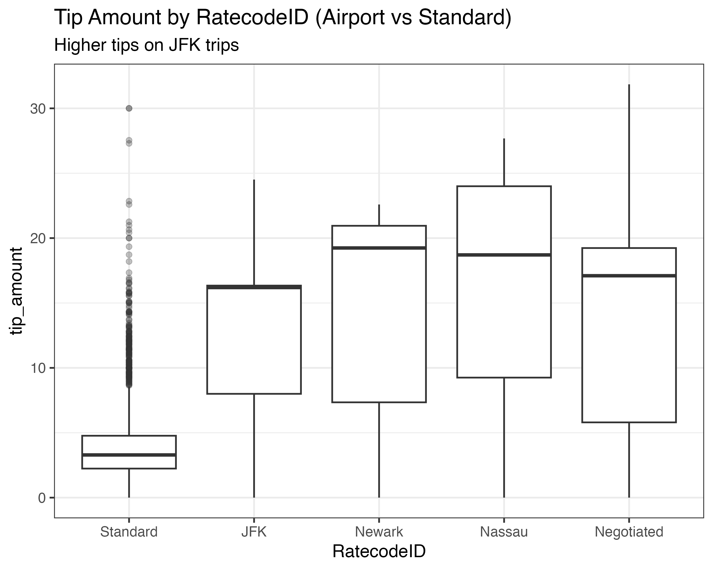
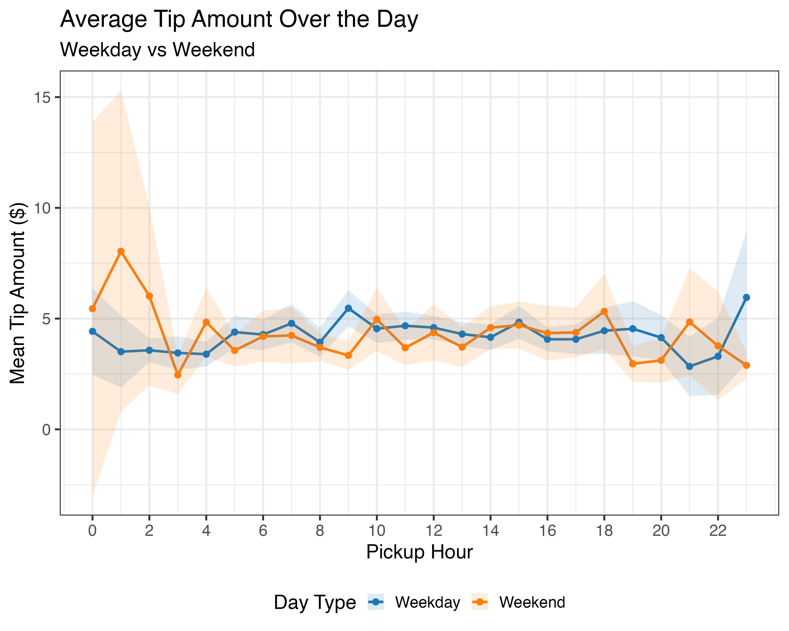

## Project Links

::: {.grid}

::: {.g-col-6}

:::

::: {.g-col-6}

:::

:::

**Data Source**: NYC Taxi & Limousine Commission (TLC) Yellow Taxi Trip Records (full year of Parquet files loaded via `arrow`).

**Technologies**: R, `tidyverse`, `arrow`, `ggplot2`, `shiny`, linear regression, RAG for chatbot.

## Project Overview

This project analyzes tipping behavior in New York City Yellow Taxis. The dual goals were:

1. **Prediction**: Build a linear regression model to predict `tip_amount`.
2. **Insights**: Develop at least two meaningful, non-trivial insights into when, where, and why riders tip more or less.

Data is loaded from PARQUET files, cleaned, and analyzed with a focused subset for high-quality insights and model performance. The project culminates in a production-ready interactive Shiny dashboard.

## Interactive R Shiny Dashboard

The dashboard lets users:

- Filter and explore tipping patterns by time, pickup/dropoff zones, trip characteristics
- View dynamic visualizations and model predictions
- Use a natural language chat interface (powered by RAG with project knowledge base, analysis, and model coefficients) to ask questions like "What factors most influence tips at JFK airport?"

**Try it live**: [powellonpoint.shinyapps.io/taxi-tips](https://powellonpoint.shinyapps.io/taxi-tips)

The app includes the saved model (`tip_model.rds`), cleaned dataset, and all insights.

## Key Insights

### 1. Airport Trips (Especially JFK) Command Significantly Higher Tips

Trips with airport rate codes (particularly JFK) show substantially higher tip amounts compared to standard metered trips. This is likely due to longer distances, fixed fares in some cases, business travelers, and cultural norms around airport transfers.

{fig-align="center" width="80%"}

### 2. Strong Temporal Patterns in Tipping Behavior

Tips vary significantly by time of day, rush hour status, overnight periods, and day of the week:

- Rush hour premiums are evident across weekdays
- Overnight trips often see different tipping dynamics
- Weekday vs weekend patterns diverge, with clear peaks during certain hours

{fig-align="center" width="80%"}

These insights were derived through extensive EDA, grouping by engineered features (rush_hour, overnight, pickup_dow, pickup_hour), and visualization with ggplot2.

## Predictive Modeling

A linear regression model was trained to predict `tip_amount` using features such as trip distance, duration, time-of-day indicators, rate code, passenger count, and location-based variables.

- Model saved and deployed in the Shiny app for real-time predictions
- Model performance and coefficients inform the RAG knowledge base for accurate chatbot responses
- Full details, validation, and diagnostics available in the [repository](https://github.com/PowellOnPoint/NYC-Yellow-Taxi-Tips/tree/main/code)

## Repository

- `code/`: Data loading (`arrow`), cleaning, validation, and modeling scripts
- `taxi-tips-shiny/`: Full Shiny application with `app.R`, plots, model artifacts
- `data/`: Parquet and processed RDS files
- `docs/`: Rendered reports, insights, executive summary

See the full [GitHub repo](https://github.com/PowellOnPoint/NYC-Yellow-Taxi-Tips) for all code, data processing pipelines, and additional resources including the executive summary PPTX.

## Learn More

- [Full Insights Report (HTML)](https://htmlpreview.github.io/?https://github.com/PowellOnPoint/NYC-Yellow-Taxi-Tips/blob/main/docs/insights.html)
- [Prediction Modeling Report](https://htmlpreview.github.io/?https://github.com/PowellOnPoint/NYC-Yellow-Taxi-Tips/blob/main/docs/prediction.html)
- [Raw Data Source](https://www.nyc.gov/site/tlc/about/tlc-trip-record-data.page){.external}

This project demonstrates end-to-end data science skills: from large-scale data handling with Parquet/Arrow, insightful EDA and visualization, statistical modeling, to production deployment of an AI-enhanced interactive web application.
